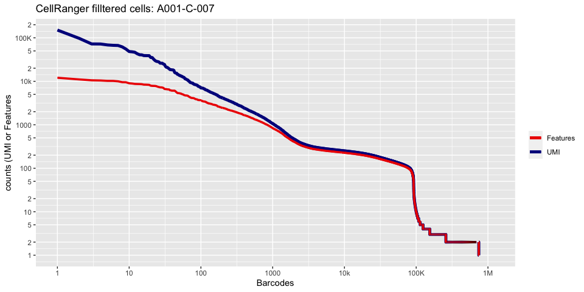
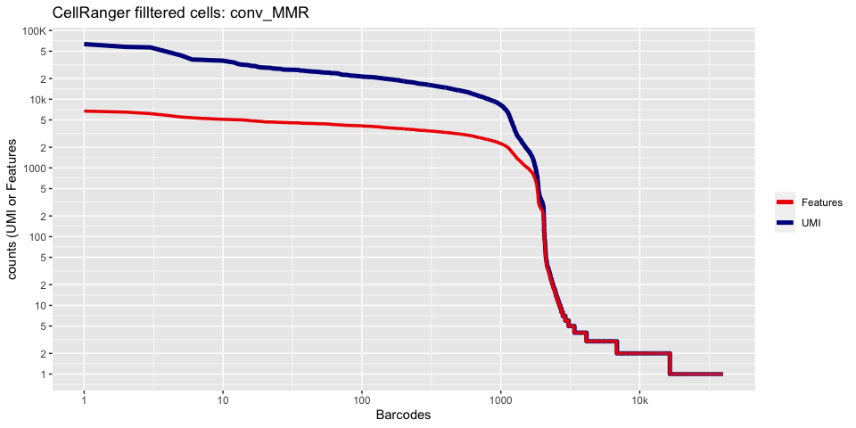

Last Updated: December 7, 2022

# Part 1: Loading data from CellRanger into R

Our first Markdown document concentrates on getting data into R and setting up our initial object.

## Single Cell Analysis with Seurat and some custom code!

[Seurat](http://satijalab.org/seurat/) (now Version 4) is a popular R package that is designed for QC, analysis, and exploration of single cell data. Seurat aims to enable users to identify and interpret sources of heterogeneity from single cell transcriptomic measurements, and to integrate diverse types of single cell data. Further, the authors provide several [tutorials](https://satijalab.org/seurat/vignettes.html), on their website.

The **expression_data_cellranger.zip** file that we have downloaded in previous step contains the single cell matrix files and HDF5 files for three single nuclei RNASeq samples from [Becker et al., 2022](https://www.nature.com/articles/s41588-022-01088-x). After uncompress the file, please make sure that you see three folders: A001-C-007, A001-C-104 and B001-A-301 in the same folder as this R markdown file.

We start each markdown document with loading needed libraries for R:


```r
# must have Seurat
library(Seurat)
library(kableExtra)
library(ggplot2)
```


### Setup the experiment folder and data info

```r
experiment_name = "Colon Cancer"
dataset_loc <- "./"
ids <- c("A001-C-007", "A001-C-104", "B001-A-301")
```


## Read in the cellranger sample metrics csv files

There is a single metrics summary file for each sample.

The code in the box below reads in a single metrics summary file. **To read in a summary file for each sample in your experiment, you should use the code in the next box instead.**


```r
experiment.metrics <- read.csv(file.path(dataset_loc, ids[1], "outs/metrics_summary.csv"))
sequencing.metrics <- data.frame(t(experiment.metrics[,c(1:19)]))
rownames(sequencing.metrics) <- gsub("\\.", " ", rownames(sequencing.metrics))
colnames(sequencing.metrics) <- "All samples"
sequencing.metrics %>%
  kable(caption = 'Cell Ranger Results') %>%
  pack_rows("Overview", 1, 3, label_row_css = "background-color: #666; color: #fff;") %>%
  pack_rows("Sequencing Characteristics", 4, 9, label_row_css = "background-color: #666; color: #fff;") %>%
  pack_rows("Mapping Characteristics", 10, 19, label_row_css = "background-color: #666; color: #fff;") %>%
  kable_styling("striped")
```

<table class="table table-striped" style="margin-left: auto; margin-right: auto;">
<caption>Cell Ranger Results</caption>
 <thead>
  <tr>
   <th style="text-align:left;">   </th>
   <th style="text-align:left;"> All samples </th>
  </tr>
 </thead>
<tbody>
  <tr grouplength="3"><td colspan="2" style="background-color: #666; color: #fff;"><strong>Overview</strong></td></tr>
<tr>
   <td style="text-align:left;padding-left: 2em;" indentlevel="1"> Estimated Number of Cells </td>
   <td style="text-align:left;"> 1,796 </td>
  </tr>
  <tr>
   <td style="text-align:left;padding-left: 2em;" indentlevel="1"> Mean Reads per Cell </td>
   <td style="text-align:left;"> 77,524 </td>
  </tr>
  <tr>
   <td style="text-align:left;padding-left: 2em;" indentlevel="1"> Median Genes per Cell </td>
   <td style="text-align:left;"> 927 </td>
  </tr>
  <tr grouplength="6"><td colspan="2" style="background-color: #666; color: #fff;"><strong>Sequencing Characteristics</strong></td></tr>
<tr>
   <td style="text-align:left;padding-left: 2em;" indentlevel="1"> Number of Reads </td>
   <td style="text-align:left;"> 139,233,487 </td>
  </tr>
  <tr>
   <td style="text-align:left;padding-left: 2em;" indentlevel="1"> Valid Barcodes </td>
   <td style="text-align:left;"> 97.4% </td>
  </tr>
  <tr>
   <td style="text-align:left;padding-left: 2em;" indentlevel="1"> Sequencing Saturation </td>
   <td style="text-align:left;"> 75.5% </td>
  </tr>
  <tr>
   <td style="text-align:left;padding-left: 2em;" indentlevel="1"> Q30 Bases in Barcode </td>
   <td style="text-align:left;"> 97.4% </td>
  </tr>
  <tr>
   <td style="text-align:left;padding-left: 2em;" indentlevel="1"> Q30 Bases in RNA Read </td>
   <td style="text-align:left;"> 95.6% </td>
  </tr>
  <tr>
   <td style="text-align:left;padding-left: 2em;" indentlevel="1"> Q30 Bases in UMI </td>
   <td style="text-align:left;"> 97.5% </td>
  </tr>
  <tr grouplength="10"><td colspan="2" style="background-color: #666; color: #fff;"><strong>Mapping Characteristics</strong></td></tr>
<tr>
   <td style="text-align:left;padding-left: 2em;" indentlevel="1"> Reads Mapped to Genome </td>
   <td style="text-align:left;"> 94.3% </td>
  </tr>
  <tr>
   <td style="text-align:left;padding-left: 2em;" indentlevel="1"> Reads Mapped Confidently to Genome </td>
   <td style="text-align:left;"> 72.3% </td>
  </tr>
  <tr>
   <td style="text-align:left;padding-left: 2em;" indentlevel="1"> Reads Mapped Confidently to Intergenic Regions </td>
   <td style="text-align:left;"> 8.2% </td>
  </tr>
  <tr>
   <td style="text-align:left;padding-left: 2em;" indentlevel="1"> Reads Mapped Confidently to Intronic Regions </td>
   <td style="text-align:left;"> 26.9% </td>
  </tr>
  <tr>
   <td style="text-align:left;padding-left: 2em;" indentlevel="1"> Reads Mapped Confidently to Exonic Regions </td>
   <td style="text-align:left;"> 37.2% </td>
  </tr>
  <tr>
   <td style="text-align:left;padding-left: 2em;" indentlevel="1"> Reads Mapped Confidently to Transcriptome </td>
   <td style="text-align:left;"> 61.1% </td>
  </tr>
  <tr>
   <td style="text-align:left;padding-left: 2em;" indentlevel="1"> Reads Mapped Antisense to Gene </td>
   <td style="text-align:left;"> 2.4% </td>
  </tr>
  <tr>
   <td style="text-align:left;padding-left: 2em;" indentlevel="1"> Fraction Reads in Cells </td>
   <td style="text-align:left;"> 29.6% </td>
  </tr>
  <tr>
   <td style="text-align:left;padding-left: 2em;" indentlevel="1"> Total Genes Detected </td>
   <td style="text-align:left;"> 23,930 </td>
  </tr>
  <tr>
   <td style="text-align:left;padding-left: 2em;" indentlevel="1"> Median UMI Counts per Cell </td>
   <td style="text-align:left;"> 1,204 </td>
  </tr>
</tbody>
</table>


```r
d10x.metrics <- lapply(ids, function(i){
  metrics <- read.csv(file.path(dataset_loc,paste0(i,"/outs"),"metrics_summary.csv"), colClasses = "character")
})
experiment.metrics <- do.call("rbind", d10x.metrics)
rownames(experiment.metrics) <- ids

sequencing.metrics <- data.frame(t(experiment.metrics[,c(1:19)]))

row.names(sequencing.metrics) <- gsub("\\."," ", rownames(sequencing.metrics))

sequencing.metrics %>%
  kable(caption = 'Cell Ranger Results') %>%
  pack_rows("Overview", 1, 3, label_row_css = "background-color: #666; color: #fff;") %>%
  pack_rows("Sequencing Characteristics", 4, 9, label_row_css = "background-color: #666; color: #fff;") %>%
  pack_rows("Mapping Characteristics", 10, 19, label_row_css = "background-color: #666; color: #fff;") %>%
  kable_styling("striped")
```


## Load the Cell Ranger Matrix Data and create the base Seurat object.
Cell Ranger provides a function `cellranger aggr` that will combine multiple samples into a single matrix file. However, when processing data in R this is unnecessary and we can quickly aggregate them in R.

Seurat provides a function `Read10X` and `Read10X_h5` to read in 10X data folder. First we read in data from each individual sample folder. 

Later, we initialize the Seurat object (`CreateSeuratObject`) with the raw (non-normalized data). Keep all cells with at least 200 detected genes. Also extracting sample names, calculating and adding in the metadata mitochondrial percentage of each cell. Adding in the metadata batchid and cell cycle. Finally, saving the raw Seurat object.

## Load the Cell Ranger Matrix Data (hdf5 file) and create the base Seurat object.

```r
d10x.data <- lapply(ids, function(i){
  d10x <- Read10X_h5(file.path(dataset_loc, i, "/outs","raw_feature_bc_matrix.h5"))
  colnames(d10x) <- paste(sapply(strsplit(colnames(d10x),split="-"),'[[',1L),i,sep="_")
  d10x
})
names(d10x.data) <- ids

str(d10x.data)
```

```
## List of 3
##  $ A001-C-007:Formal class 'dgCMatrix' [package "Matrix"] with 6 slots
##   .. ..@ i       : int [1:16845098] 13849 300 539 916 2153 2320 3196 4057 4317 4786 ...
##   .. ..@ p       : int [1:1189230] 0 1 1 100 101 102 103 240 241 241 ...
##   .. ..@ Dim     : int [1:2] 36601 1189229
##   .. ..@ Dimnames:List of 2
##   .. .. ..$ : chr [1:36601] "MIR1302-2HG" "FAM138A" "OR4F5" "AL627309.1" ...
##   .. .. ..$ : chr [1:1189229] "AAACCCAAGAAACCCA_A001-C-007" "AAACCCAAGAAACCCG_A001-C-007" "AAACCCAAGAAACTGT_A001-C-007" "AAACCCAAGAAAGCGA_A001-C-007" ...
##   .. ..@ x       : num [1:16845098] 1 1 1 1 1 1 1 1 1 1 ...
##   .. ..@ factors : list()
##  $ A001-C-104:Formal class 'dgCMatrix' [package "Matrix"] with 6 slots
##   .. ..@ i       : int [1:23825766] 4368 31446 33637 35689 36562 8075 24917 8224 17208 20003 ...
##   .. ..@ p       : int [1:1730419] 0 0 0 5 5 5 5 6 6 7 ...
##   .. ..@ Dim     : int [1:2] 36601 1730418
##   .. ..@ Dimnames:List of 2
##   .. .. ..$ : chr [1:36601] "MIR1302-2HG" "FAM138A" "OR4F5" "AL627309.1" ...
##   .. .. ..$ : chr [1:1730418] "AAACCCAAGAAACACT_A001-C-104" "AAACCCAAGAAACTAC_A001-C-104" "AAACCCAAGAAACTGT_A001-C-104" "AAACCCAAGAAAGACA_A001-C-104" ...
##   .. ..@ x       : num [1:23825766] 1 1 1 1 1 1 1 1 1 1 ...
##   .. ..@ factors : list()
##  $ B001-A-301:Formal class 'dgCMatrix' [package "Matrix"] with 6 slots
##   .. ..@ i       : int [1:30822123] 13919 12548 15202 24697 3084 35555 27737 36565 8592 1173 ...
##   .. ..@ p       : int [1:1639591] 0 1 4 6 7 7 8 8 9 9 ...
##   .. ..@ Dim     : int [1:2] 36601 1639590
##   .. ..@ Dimnames:List of 2
##   .. .. ..$ : chr [1:36601] "MIR1302-2HG" "FAM138A" "OR4F5" "AL627309.1" ...
##   .. .. ..$ : chr [1:1639590] "AAACCCAAGAAACCAT_B001-A-301" "AAACCCAAGAAACCCG_B001-A-301" "AAACCCAAGAAACTCA_B001-A-301" "AAACCCAAGAAACTGT_B001-A-301" ...
##   .. ..@ x       : num [1:30822123] 1 1 1 1 1 1 1 1 1 1 ...
##   .. ..@ factors : list()
```

If you don't have the needed hdf5 libraries you can read in the matrix files like such


```r
d10x.data <- sapply(ids, function(i){
  d10x <- Read10X(file.path(dataset_loc, i, "/outs","raw_feature_bc_matrix"))
  colnames(d10x) <- paste(sapply(strsplit(colnames(d10x), split="-"), '[[', 1L), i, sep="_")
  d10x
})
names(d10x.data) <- ids
```


Lets recreate the barcode rank plot from the Cell Ranger web summary file.

To color each barcode rank plot using the number of cells estimated by Cell Ranger, skip the code in the box below and use the next one instead.

```r
plot_cellranger_cells <- function(ind){
  xbreaks = c(1,1e1,1e2,1e3,1e4,1e5,1e6)
  xlabels = c("1","10","100","1000","10k","100K","1M")
  ybreaks = c(1,2,5,10,20,50,100,200,500,1000,2000,5000,10000,20000,50000,100000,200000,500000,1000000)
  ylabels = c("1","2","5","10","2","5","100","2","5","1000","2","5","10k","2","5","100K","2","5","1M")

  pl1 <- data.frame(index=seq.int(1,ncol(d10x.data[[ind]])),
                    nCount_RNA = sort(Matrix:::colSums(d10x.data[[ind]])+1,decreasing=T),
                    nFeature_RNA = sort(Matrix:::colSums(d10x.data[[ind]]>0)+1,decreasing=T)) %>%
    ggplot() + 
    scale_color_manual(values=c("red2","blue4"), labels=c("Features", "UMI"), name=NULL) +
    ggtitle(paste("CellRanger filltered cells:",ids[ind],sep=" ")) + xlab("Barcodes") + ylab("counts (UMI or Features") + 
    scale_x_continuous(trans = 'log2', breaks=xbreaks, labels = xlabels) + 
    scale_y_continuous(trans = 'log2', breaks=ybreaks, labels = ylabels) +
    geom_line(aes(x=index, y=nCount_RNA, color = "UMI"), size=1.75) +
    geom_line(aes(x=index, y=nFeature_RNA, color = "Features"), size=1.25)

  return(pl1)
}

plot_cellranger_cells(1)
```

```
## Warning: Using `size` aesthetic for lines was deprecated in ggplot2 3.4.0.
## ℹ Please use `linewidth` instead.
```

<!-- -->

```r
plot_cellranger_cells(2)
```

<!-- -->

```r
plot_cellranger_cells(3)
```

<!-- -->


```r
cr_filtered_cells <- as.numeric(gsub(",","",as.character(unlist(sequencing.metrics["Estimated Number of Cells",]))))

plot_cellranger_cells <- function(ind){
  xbreaks = c(1,1e1,1e2,1e3,1e4,1e5,1e6)
  xlabels = c("1","10","100","1000","10k","100K","1M")
  ybreaks = c(1,2,5,10,20,50,100,200,500,1000,2000,5000,10000,20000,50000,100000,200000,500000,1000000)
  ylabels = c("1","2","5","10","2","5","100","2","5","1000","2","5","10k","2","5","100K","2","5","1M")

  pl1 <- data.frame(index=seq.int(1,ncol(d10x.data[[ind]])), nCount_RNA = sort(Matrix:::colSums(d10x.data[[ind]])+1,decreasing=T), nFeature_RNA = sort(Matrix:::colSums(d10x.data[[ind]]>0)+1,decreasing=T)) %>% ggplot() + 
    scale_color_manual(values=c("grey50","red2","blue4"), labels=c("UMI_Background", "Features", "UMI_Cells"), name=NULL) +
    ggtitle(paste("CellRanger filltered cells:",ids[ind],sep=" ")) + xlab("Barcodes") + ylab("counts (UMI or Features") + 
    scale_x_continuous(trans = 'log2', breaks=xbreaks, labels = xlabels) + 
    scale_y_continuous(trans = 'log2', breaks=ybreaks, labels = ylabels) +
    geom_line(aes(x=index, y=nCount_RNA, color=index<=cr_filtered_cells[ind] , group=1), size=1.75) +
    geom_line(aes(x=index, y=nFeature_RNA, color="Features", group=1), size=1.25)

  return(pl1)
}

plot_cellranger_cells(1)
plot_cellranger_cells(2)
plot_cellranger_cells(3)
```


### Create the Seurat object

Filter criteria: remove genes that do not occur in a minimum of 10 cells and remove cells that don't have a minimum of 200 features


```r
experiment.data <- do.call("cbind", d10x.data)

experiment.aggregate <- CreateSeuratObject(
  experiment.data,
  project = experiment_name,
  min.cells = 10,
  min.features = 300,
  names.field = 2,
  names.delim = "\\_")

experiment.aggregate
```

```
## An object of class Seurat 
## 21005 features across 30902 samples within 1 assay 
## Active assay: RNA (21005 features, 0 variable features)
```

```r
str(experiment.aggregate)
```

```
## Formal class 'Seurat' [package "SeuratObject"] with 13 slots
##   ..@ assays      :List of 1
##   .. ..$ RNA:Formal class 'Assay' [package "SeuratObject"] with 8 slots
##   .. .. .. ..@ counts       :Formal class 'dgCMatrix' [package "Matrix"] with 6 slots
##   .. .. .. .. .. ..@ i       : int [1:20692774] 254 391 396 416 484 511 543 595 799 862 ...
##   .. .. .. .. .. ..@ p       : int [1:30903] 0 322 721 2268 2955 3365 3831 4188 4626 5164 ...
##   .. .. .. .. .. ..@ Dim     : int [1:2] 21005 30902
##   .. .. .. .. .. ..@ Dimnames:List of 2
##   .. .. .. .. .. .. ..$ : chr [1:21005] "AL627309.1" "AL627309.5" "LINC01409" "LINC01128" ...
##   .. .. .. .. .. .. ..$ : chr [1:30902] "AAACCCAAGGTCCCTG_A001-C-007" "AAACCCAAGTTACGAA_A001-C-007" "AAACCCAAGTTATGGA_A001-C-007" "AAACCCACAACGCCCA_A001-C-007" ...
##   .. .. .. .. .. ..@ x       : num [1:20692774] 1 1 1 1 1 1 1 1 1 1 ...
##   .. .. .. .. .. ..@ factors : list()
##   .. .. .. ..@ data         :Formal class 'dgCMatrix' [package "Matrix"] with 6 slots
##   .. .. .. .. .. ..@ i       : int [1:20692774] 254 391 396 416 484 511 543 595 799 862 ...
##   .. .. .. .. .. ..@ p       : int [1:30903] 0 322 721 2268 2955 3365 3831 4188 4626 5164 ...
##   .. .. .. .. .. ..@ Dim     : int [1:2] 21005 30902
##   .. .. .. .. .. ..@ Dimnames:List of 2
##   .. .. .. .. .. .. ..$ : chr [1:21005] "AL627309.1" "AL627309.5" "LINC01409" "LINC01128" ...
##   .. .. .. .. .. .. ..$ : chr [1:30902] "AAACCCAAGGTCCCTG_A001-C-007" "AAACCCAAGTTACGAA_A001-C-007" "AAACCCAAGTTATGGA_A001-C-007" "AAACCCACAACGCCCA_A001-C-007" ...
##   .. .. .. .. .. ..@ x       : num [1:20692774] 1 1 1 1 1 1 1 1 1 1 ...
##   .. .. .. .. .. ..@ factors : list()
##   .. .. .. ..@ scale.data   : num[0 , 0 ] 
##   .. .. .. ..@ key          : chr "rna_"
##   .. .. .. ..@ assay.orig   : NULL
##   .. .. .. ..@ var.features : logi(0) 
##   .. .. .. ..@ meta.features:'data.frame':	21005 obs. of  0 variables
##   .. .. .. ..@ misc         : list()
##   ..@ meta.data   :'data.frame':	30902 obs. of  3 variables:
##   .. ..$ orig.ident  : Factor w/ 3 levels "A001-C-007","A001-C-104",..: 1 1 1 1 1 1 1 1 1 1 ...
##   .. ..$ nCount_RNA  : num [1:30902] 361 459 2076 854 496 ...
##   .. ..$ nFeature_RNA: int [1:30902] 322 399 1547 687 410 466 357 438 538 307 ...
##   ..@ active.assay: chr "RNA"
##   ..@ active.ident: Factor w/ 3 levels "A001-C-007","A001-C-104",..: 1 1 1 1 1 1 1 1 1 1 ...
##   .. ..- attr(*, "names")= chr [1:30902] "AAACCCAAGGTCCCTG_A001-C-007" "AAACCCAAGTTACGAA_A001-C-007" "AAACCCAAGTTATGGA_A001-C-007" "AAACCCACAACGCCCA_A001-C-007" ...
##   ..@ graphs      : list()
##   ..@ neighbors   : list()
##   ..@ reductions  : list()
##   ..@ images      : list()
##   ..@ project.name: chr "Colon Cancer"
##   ..@ misc        : list()
##   ..@ version     :Classes 'package_version', 'numeric_version'  hidden list of 1
##   .. ..$ : int [1:3] 4 1 3
##   ..@ commands    : list()
##   ..@ tools       : list()
```

### The percentage of reads that map to the mitochondrial genome

* Low-quality / dying cells often exhibit extensive mitochondrial contamination.
* We calculate mitochondrial QC metrics with the PercentageFeatureSet function, which calculates the percentage of counts originating from a set of features.
* We use the set of all genes, in mouse these genes can be identified as those that begin with 'mt', in human data they begin with MT.


```r
experiment.aggregate$percent.mito <- PercentageFeatureSet(experiment.aggregate, pattern = "^MT-")
summary(experiment.aggregate$percent.mito)
```

```
##    Min. 1st Qu.  Median    Mean 3rd Qu.    Max. 
##  0.0000  0.8622  1.6713  1.8490  2.4457 46.6468
```

### Lets spend a little time getting to know the Seurat object.

The Seurat object is the center of each single cell analysis. It stores __all__ information associated with the dataset, including data, annotations, analyses, etc. The R function slotNames can be used to view the slot names within an object.


```r
slotNames(experiment.aggregate)
```

```
##  [1] "assays"       "meta.data"    "active.assay" "active.ident" "graphs"      
##  [6] "neighbors"    "reductions"   "images"       "project.name" "misc"        
## [11] "version"      "commands"     "tools"
```


```r
head(experiment.aggregate[[]])
```

```
##                             orig.ident nCount_RNA nFeature_RNA percent.mito
## AAACCCAAGGTCCCTG_A001-C-007 A001-C-007        361          322    2.7700831
## AAACCCAAGTTACGAA_A001-C-007 A001-C-007        459          399    2.6143791
## AAACCCAAGTTATGGA_A001-C-007 A001-C-007       2076         1547    0.5780347
## AAACCCACAACGCCCA_A001-C-007 A001-C-007        854          687    1.5222482
## AAACCCACAAGTAGTA_A001-C-007 A001-C-007        496          410    2.8225806
## AAACCCACAGAAGTTA_A001-C-007 A001-C-007        540          466    1.6666667
```

#### Question(s)

1. What slots are empty, what slots have data?
2. What columns are available in meta.data?
3. Look up the help documentation for subset?


## Finally, save the original object and view the object.

Original data set in Seurat class, with no filtering

```r
save(experiment.aggregate,file="original_seurat_object.RData")
```

## Get the next Rmd file

```r
download.file("https://raw.githubusercontent.com/ucdavis-bioinformatics-training/2022-December-Single-Cell-RNA-Seq-Analysis/main/data_analysis/scRNA_Workshop-PART2.Rmd", "scRNA_Workshop-PART2.Rmd")
```

## Session Information

```r
sessionInfo()
```

```
## R version 4.2.2 (2022-10-31)
## Platform: x86_64-apple-darwin17.0 (64-bit)
## Running under: macOS Catalina 10.15.7
## 
## Matrix products: default
## BLAS:   /Library/Frameworks/R.framework/Versions/4.2/Resources/lib/libRblas.0.dylib
## LAPACK: /Library/Frameworks/R.framework/Versions/4.2/Resources/lib/libRlapack.dylib
## 
## locale:
## [1] en_US.UTF-8/en_US.UTF-8/en_US.UTF-8/C/en_US.UTF-8/en_US.UTF-8
## 
## attached base packages:
## [1] stats     graphics  grDevices utils     datasets  methods   base     
## 
## other attached packages:
## [1] ggplot2_3.4.0      kableExtra_1.3.4   SeuratObject_4.1.3 Seurat_4.3.0      
## 
## loaded via a namespace (and not attached):
##   [1] Rtsne_0.16             colorspace_2.0-3       deldir_1.0-6          
##   [4] ellipsis_0.3.2         ggridges_0.5.4         rstudioapi_0.14       
##   [7] spatstat.data_3.0-0    farver_2.1.1           leiden_0.4.3          
##  [10] listenv_0.8.0          bit64_4.0.5            ggrepel_0.9.2         
##  [13] fansi_1.0.3            xml2_1.3.3             codetools_0.2-18      
##  [16] splines_4.2.2          cachem_1.0.6           knitr_1.41            
##  [19] polyclip_1.10-4        jsonlite_1.8.3         ica_1.0-3             
##  [22] cluster_2.1.4          png_0.1-8              uwot_0.1.14           
##  [25] shiny_1.7.3            sctransform_0.3.5      spatstat.sparse_3.0-0 
##  [28] compiler_4.2.2         httr_1.4.4             assertthat_0.2.1      
##  [31] Matrix_1.5-3           fastmap_1.1.0          lazyeval_0.2.2        
##  [34] cli_3.4.1              later_1.3.0            htmltools_0.5.3       
##  [37] tools_4.2.2            igraph_1.3.5           gtable_0.3.1          
##  [40] glue_1.6.2             RANN_2.6.1             reshape2_1.4.4        
##  [43] dplyr_1.0.10           Rcpp_1.0.9             scattermore_0.8       
##  [46] jquerylib_0.1.4        vctrs_0.5.1            svglite_2.1.0         
##  [49] nlme_3.1-160           spatstat.explore_3.0-5 progressr_0.11.0      
##  [52] lmtest_0.9-40          spatstat.random_3.0-1  xfun_0.35             
##  [55] stringr_1.4.1          globals_0.16.2         rvest_1.0.3           
##  [58] mime_0.12              miniUI_0.1.1.1         lifecycle_1.0.3       
##  [61] irlba_2.3.5.1          goftest_1.2-3          future_1.29.0         
##  [64] MASS_7.3-58.1          zoo_1.8-11             scales_1.2.1          
##  [67] promises_1.2.0.1       spatstat.utils_3.0-1   parallel_4.2.2        
##  [70] RColorBrewer_1.1-3     yaml_2.3.6             reticulate_1.26       
##  [73] pbapply_1.6-0          gridExtra_2.3          sass_0.4.4            
##  [76] stringi_1.7.8          highr_0.9              systemfonts_1.0.4     
##  [79] rlang_1.0.6            pkgconfig_2.0.3        matrixStats_0.63.0    
##  [82] evaluate_0.18          lattice_0.20-45        tensor_1.5            
##  [85] ROCR_1.0-11            purrr_0.3.5            patchwork_1.1.2       
##  [88] htmlwidgets_1.5.4      bit_4.0.5              cowplot_1.1.1         
##  [91] tidyselect_1.2.0       parallelly_1.32.1      RcppAnnoy_0.0.20      
##  [94] plyr_1.8.8             magrittr_2.0.3         R6_2.5.1              
##  [97] generics_0.1.3         DBI_1.1.3              withr_2.5.0           
## [100] pillar_1.8.1           fitdistrplus_1.1-8     survival_3.4-0        
## [103] abind_1.4-5            sp_1.5-1               tibble_3.1.8          
## [106] future.apply_1.10.0    hdf5r_1.3.7            KernSmooth_2.23-20    
## [109] utf8_1.2.2             spatstat.geom_3.0-3    plotly_4.10.1         
## [112] rmarkdown_2.18         grid_4.2.2             data.table_1.14.6     
## [115] webshot_0.5.4          digest_0.6.30          xtable_1.8-4          
## [118] tidyr_1.2.1            httpuv_1.6.6           munsell_0.5.0         
## [121] viridisLite_0.4.1      bslib_0.4.1
```
