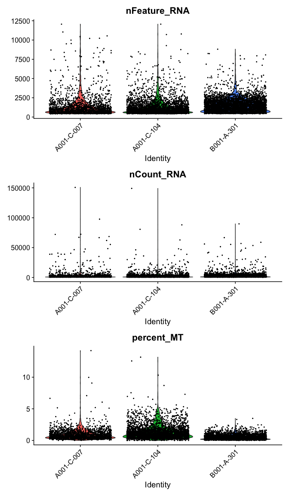
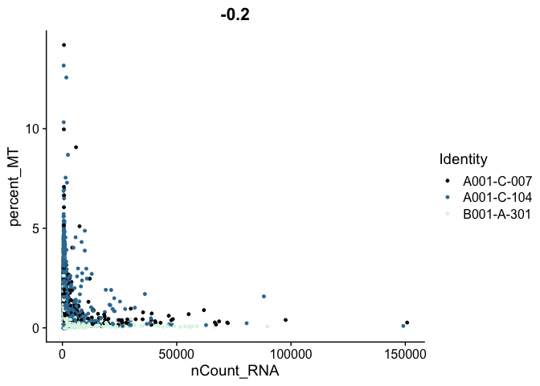
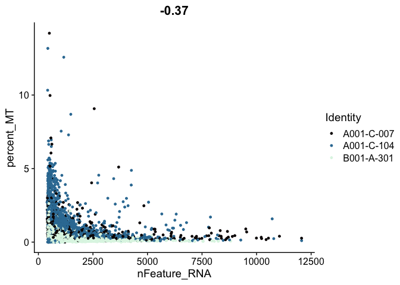

<script>
function buildQuiz(myq, qc){
  // variable to store the HTML output
  const output = [];

  // for each question...
  myq.forEach(
    (currentQuestion, questionNumber) => {

      // variable to store the list of possible answers
      const answers = [];

      // and for each available answer...
      for(letter in currentQuestion.answers){

        // ...add an HTML radio button
        answers.push(
          `<label>
            <input type="radio" name="question${questionNumber}" value="${letter}">
            ${letter} :
            ${currentQuestion.answers[letter]}
          </label><br/>`
        );
      }

      // add this question and its answers to the output
      output.push(
        `<div class="question"> ${currentQuestion.question} </div>
        <div class="answers"> ${answers.join('')} </div><br/>`
      );
    }
  );

  // finally combine our output list into one string of HTML and put it on the page
  qc.innerHTML = output.join('');
}

function showResults(myq, qc, rc){

  // gather answer containers from our quiz
  const answerContainers = qc.querySelectorAll('.answers');

  // keep track of user's answers
  let numCorrect = 0;

  // for each question...
  myq.forEach( (currentQuestion, questionNumber) => {

    // find selected answer
    const answerContainer = answerContainers[questionNumber];
    const selector = `input[name=question${questionNumber}]:checked`;
    const userAnswer = (answerContainer.querySelector(selector) || {}).value;

    // if answer is correct
    if(userAnswer === currentQuestion.correctAnswer){
      // add to the number of correct answers
      numCorrect++;

      // color the answers green
      answerContainers[questionNumber].style.color = 'lightgreen';
    }
    // if answer is wrong or blank
    else{
      // color the answers red
      answerContainers[questionNumber].style.color = 'red';
    }
  });

  // show number of correct answers out of total
  rc.innerHTML = `${numCorrect} out of ${myq.length}`;
}
</script>

Last Updated: March 20 2022

# Part 2: Some QA/QC, filtering and normalization

## Load libraries

```r
library(Seurat)
library(biomaRt)
library(ggplot2)
library(knitr)
library(kableExtra)
```

## Load the Seurat object from part 1

```r
load(file="original_seurat_object.RData")
experiment.aggregate
```

<div class='r_output'> An object of class Seurat
 36601 features across 5803 samples within 1 assay
 Active assay: RNA (36601 features, 0 variable features)
</div>
```r
set.seed(12345)
```

## Some basic QA/QC of the metadata, print tables of the 5% quantiles.

Show 5% quantiles for number of genes per cell per sample

```r
kable(do.call("cbind", tapply(experiment.aggregate$nFeature_RNA,
                      Idents(experiment.aggregate),quantile,probs=seq(0,1,0.05))),
      caption = "5% Quantiles of Genes/Cell by Sample") %>% kable_styling()
```

<table class="table" style="margin-left: auto; margin-right: auto;">
<caption>5% Quantiles of Genes/Cell by Sample</caption>
 <thead>
  <tr>
   <th style="text-align:left;">   </th>
   <th style="text-align:right;"> conv_COVID </th>
   <th style="text-align:right;"> conv_MMR </th>
   <th style="text-align:right;"> conv_Tdap </th>
   <th style="text-align:right;"> norm_COVID </th>
  </tr>
 </thead>
<tbody>
  <tr>
   <td style="text-align:left;"> 0% </td>
   <td style="text-align:right;"> 302.0 </td>
   <td style="text-align:right;"> 300.0 </td>
   <td style="text-align:right;"> 307.00 </td>
   <td style="text-align:right;"> 302 </td>
  </tr>
  <tr>
   <td style="text-align:left;"> 5% </td>
   <td style="text-align:right;"> 669.2 </td>
   <td style="text-align:right;"> 657.4 </td>
   <td style="text-align:right;"> 675.85 </td>
   <td style="text-align:right;"> 430 </td>
  </tr>
  <tr>
   <td style="text-align:left;"> 10% </td>
   <td style="text-align:right;"> 846.4 </td>
   <td style="text-align:right;"> 847.0 </td>
   <td style="text-align:right;"> 873.20 </td>
   <td style="text-align:right;"> 530 </td>
  </tr>
  <tr>
   <td style="text-align:left;"> 15% </td>
   <td style="text-align:right;"> 1011.1 </td>
   <td style="text-align:right;"> 964.0 </td>
   <td style="text-align:right;"> 1021.00 </td>
   <td style="text-align:right;"> 627 </td>
  </tr>
  <tr>
   <td style="text-align:left;"> 20% </td>
   <td style="text-align:right;"> 1160.2 </td>
   <td style="text-align:right;"> 1067.6 </td>
   <td style="text-align:right;"> 1167.60 </td>
   <td style="text-align:right;"> 728 </td>
  </tr>
  <tr>
   <td style="text-align:left;"> 25% </td>
   <td style="text-align:right;"> 1323.0 </td>
   <td style="text-align:right;"> 1199.0 </td>
   <td style="text-align:right;"> 1350.75 </td>
   <td style="text-align:right;"> 815 </td>
  </tr>
  <tr>
   <td style="text-align:left;"> 30% </td>
   <td style="text-align:right;"> 1522.6 </td>
   <td style="text-align:right;"> 1375.2 </td>
   <td style="text-align:right;"> 1618.60 </td>
   <td style="text-align:right;"> 889 </td>
  </tr>
  <tr>
   <td style="text-align:left;"> 35% </td>
   <td style="text-align:right;"> 1876.8 </td>
   <td style="text-align:right;"> 1638.5 </td>
   <td style="text-align:right;"> 1908.25 </td>
   <td style="text-align:right;"> 940 </td>
  </tr>
  <tr>
   <td style="text-align:left;"> 40% </td>
   <td style="text-align:right;"> 2123.0 </td>
   <td style="text-align:right;"> 1982.6 </td>
   <td style="text-align:right;"> 2119.00 </td>
   <td style="text-align:right;"> 987 </td>
  </tr>
  <tr>
   <td style="text-align:left;"> 45% </td>
   <td style="text-align:right;"> 2328.3 </td>
   <td style="text-align:right;"> 2190.6 </td>
   <td style="text-align:right;"> 2282.95 </td>
   <td style="text-align:right;"> 1018 </td>
  </tr>
  <tr>
   <td style="text-align:left;"> 50% </td>
   <td style="text-align:right;"> 2472.0 </td>
   <td style="text-align:right;"> 2370.0 </td>
   <td style="text-align:right;"> 2451.50 </td>
   <td style="text-align:right;"> 1062 </td>
  </tr>
  <tr>
   <td style="text-align:left;"> 55% </td>
   <td style="text-align:right;"> 2605.7 </td>
   <td style="text-align:right;"> 2518.0 </td>
   <td style="text-align:right;"> 2567.05 </td>
   <td style="text-align:right;"> 1105 </td>
  </tr>
  <tr>
   <td style="text-align:left;"> 60% </td>
   <td style="text-align:right;"> 2756.4 </td>
   <td style="text-align:right;"> 2667.0 </td>
   <td style="text-align:right;"> 2679.80 </td>
   <td style="text-align:right;"> 1128 </td>
  </tr>
  <tr>
   <td style="text-align:left;"> 65% </td>
   <td style="text-align:right;"> 2872.1 </td>
   <td style="text-align:right;"> 2835.3 </td>
   <td style="text-align:right;"> 2820.15 </td>
   <td style="text-align:right;"> 1165 </td>
  </tr>
  <tr>
   <td style="text-align:left;"> 70% </td>
   <td style="text-align:right;"> 2994.8 </td>
   <td style="text-align:right;"> 3019.6 </td>
   <td style="text-align:right;"> 2971.70 </td>
   <td style="text-align:right;"> 1205 </td>
  </tr>
  <tr>
   <td style="text-align:left;"> 75% </td>
   <td style="text-align:right;"> 3155.0 </td>
   <td style="text-align:right;"> 3173.5 </td>
   <td style="text-align:right;"> 3144.50 </td>
   <td style="text-align:right;"> 1246 </td>
  </tr>
  <tr>
   <td style="text-align:left;"> 80% </td>
   <td style="text-align:right;"> 3347.0 </td>
   <td style="text-align:right;"> 3327.8 </td>
   <td style="text-align:right;"> 3304.80 </td>
   <td style="text-align:right;"> 1280 </td>
  </tr>
  <tr>
   <td style="text-align:left;"> 85% </td>
   <td style="text-align:right;"> 3495.9 </td>
   <td style="text-align:right;"> 3498.9 </td>
   <td style="text-align:right;"> 3477.35 </td>
   <td style="text-align:right;"> 1324 </td>
  </tr>
  <tr>
   <td style="text-align:left;"> 90% </td>
   <td style="text-align:right;"> 3704.8 </td>
   <td style="text-align:right;"> 3735.8 </td>
   <td style="text-align:right;"> 3712.90 </td>
   <td style="text-align:right;"> 1376 </td>
  </tr>
  <tr>
   <td style="text-align:left;"> 95% </td>
   <td style="text-align:right;"> 3989.3 </td>
   <td style="text-align:right;"> 4117.3 </td>
   <td style="text-align:right;"> 4071.35 </td>
   <td style="text-align:right;"> 1462 </td>
  </tr>
  <tr>
   <td style="text-align:left;"> 100% </td>
   <td style="text-align:right;"> 6251.0 </td>
   <td style="text-align:right;"> 6718.0 </td>
   <td style="text-align:right;"> 5395.00 </td>
   <td style="text-align:right;"> 3336 </td>
  </tr>
</tbody>
</table>

Show 5% quantiles for number of UMI per cell per sample

```r
kable(do.call("cbind", tapply(experiment.aggregate$nCount_RNA,
                                      Idents(experiment.aggregate),quantile,probs=seq(0,1,0.05))),
      caption = "5% Quantiles of UMI/Cell by Sample") %>% kable_styling()
```

<table class="table" style="margin-left: auto; margin-right: auto;">
<caption>5% Quantiles of UMI/Cell by Sample</caption>
 <thead>
  <tr>
   <th style="text-align:left;">   </th>
   <th style="text-align:right;"> conv_COVID </th>
   <th style="text-align:right;"> conv_MMR </th>
   <th style="text-align:right;"> conv_Tdap </th>
   <th style="text-align:right;"> norm_COVID </th>
  </tr>
 </thead>
<tbody>
  <tr>
   <td style="text-align:left;"> 0% </td>
   <td style="text-align:right;"> 394.0 </td>
   <td style="text-align:right;"> 392.0 </td>
   <td style="text-align:right;"> 397.00 </td>
   <td style="text-align:right;"> 410 </td>
  </tr>
  <tr>
   <td style="text-align:left;"> 5% </td>
   <td style="text-align:right;"> 1021.5 </td>
   <td style="text-align:right;"> 992.0 </td>
   <td style="text-align:right;"> 1020.85 </td>
   <td style="text-align:right;"> 653 </td>
  </tr>
  <tr>
   <td style="text-align:left;"> 10% </td>
   <td style="text-align:right;"> 1481.2 </td>
   <td style="text-align:right;"> 1429.0 </td>
   <td style="text-align:right;"> 1493.00 </td>
   <td style="text-align:right;"> 838 </td>
  </tr>
  <tr>
   <td style="text-align:left;"> 15% </td>
   <td style="text-align:right;"> 1882.1 </td>
   <td style="text-align:right;"> 1730.0 </td>
   <td style="text-align:right;"> 1844.00 </td>
   <td style="text-align:right;"> 1004 </td>
  </tr>
  <tr>
   <td style="text-align:left;"> 20% </td>
   <td style="text-align:right;"> 2241.4 </td>
   <td style="text-align:right;"> 2028.4 </td>
   <td style="text-align:right;"> 2300.00 </td>
   <td style="text-align:right;"> 1168 </td>
  </tr>
  <tr>
   <td style="text-align:left;"> 25% </td>
   <td style="text-align:right;"> 2797.5 </td>
   <td style="text-align:right;"> 2455.5 </td>
   <td style="text-align:right;"> 2858.25 </td>
   <td style="text-align:right;"> 1347 </td>
  </tr>
  <tr>
   <td style="text-align:left;"> 30% </td>
   <td style="text-align:right;"> 3858.0 </td>
   <td style="text-align:right;"> 2969.0 </td>
   <td style="text-align:right;"> 4028.20 </td>
   <td style="text-align:right;"> 1553 </td>
  </tr>
  <tr>
   <td style="text-align:left;"> 35% </td>
   <td style="text-align:right;"> 5685.3 </td>
   <td style="text-align:right;"> 4249.1 </td>
   <td style="text-align:right;"> 6007.75 </td>
   <td style="text-align:right;"> 1858 </td>
  </tr>
  <tr>
   <td style="text-align:left;"> 40% </td>
   <td style="text-align:right;"> 7320.6 </td>
   <td style="text-align:right;"> 6444.2 </td>
   <td style="text-align:right;"> 7485.20 </td>
   <td style="text-align:right;"> 2026 </td>
  </tr>
  <tr>
   <td style="text-align:left;"> 45% </td>
   <td style="text-align:right;"> 8346.0 </td>
   <td style="text-align:right;"> 7825.1 </td>
   <td style="text-align:right;"> 8602.00 </td>
   <td style="text-align:right;"> 2172 </td>
  </tr>
  <tr>
   <td style="text-align:left;"> 50% </td>
   <td style="text-align:right;"> 9222.0 </td>
   <td style="text-align:right;"> 8914.0 </td>
   <td style="text-align:right;"> 9479.00 </td>
   <td style="text-align:right;"> 2288 </td>
  </tr>
  <tr>
   <td style="text-align:left;"> 55% </td>
   <td style="text-align:right;"> 10050.1 </td>
   <td style="text-align:right;"> 9685.4 </td>
   <td style="text-align:right;"> 10240.95 </td>
   <td style="text-align:right;"> 2384 </td>
  </tr>
  <tr>
   <td style="text-align:left;"> 60% </td>
   <td style="text-align:right;"> 10834.0 </td>
   <td style="text-align:right;"> 10649.2 </td>
   <td style="text-align:right;"> 11206.60 </td>
   <td style="text-align:right;"> 2521 </td>
  </tr>
  <tr>
   <td style="text-align:left;"> 65% </td>
   <td style="text-align:right;"> 11821.5 </td>
   <td style="text-align:right;"> 11633.1 </td>
   <td style="text-align:right;"> 12141.35 </td>
   <td style="text-align:right;"> 2681 </td>
  </tr>
  <tr>
   <td style="text-align:left;"> 70% </td>
   <td style="text-align:right;"> 12781.0 </td>
   <td style="text-align:right;"> 12799.6 </td>
   <td style="text-align:right;"> 13170.80 </td>
   <td style="text-align:right;"> 2890 </td>
  </tr>
  <tr>
   <td style="text-align:left;"> 75% </td>
   <td style="text-align:right;"> 13934.0 </td>
   <td style="text-align:right;"> 13752.0 </td>
   <td style="text-align:right;"> 14181.00 </td>
   <td style="text-align:right;"> 3092 </td>
  </tr>
  <tr>
   <td style="text-align:left;"> 80% </td>
   <td style="text-align:right;"> 14956.2 </td>
   <td style="text-align:right;"> 15047.2 </td>
   <td style="text-align:right;"> 15545.00 </td>
   <td style="text-align:right;"> 3354 </td>
  </tr>
  <tr>
   <td style="text-align:left;"> 85% </td>
   <td style="text-align:right;"> 16350.6 </td>
   <td style="text-align:right;"> 16541.7 </td>
   <td style="text-align:right;"> 16942.25 </td>
   <td style="text-align:right;"> 3508 </td>
  </tr>
  <tr>
   <td style="text-align:left;"> 90% </td>
   <td style="text-align:right;"> 18092.6 </td>
   <td style="text-align:right;"> 18609.8 </td>
   <td style="text-align:right;"> 18735.90 </td>
   <td style="text-align:right;"> 3810 </td>
  </tr>
  <tr>
   <td style="text-align:left;"> 95% </td>
   <td style="text-align:right;"> 20486.6 </td>
   <td style="text-align:right;"> 21617.9 </td>
   <td style="text-align:right;"> 22126.75 </td>
   <td style="text-align:right;"> 4173 </td>
  </tr>
  <tr>
   <td style="text-align:left;"> 100% </td>
   <td style="text-align:right;"> 51229.0 </td>
   <td style="text-align:right;"> 63454.0 </td>
   <td style="text-align:right;"> 48334.00 </td>
   <td style="text-align:right;"> 13527 </td>
  </tr>
</tbody>
</table>

Show 5% quantiles for number of mitochondrial percentage per cell per sample

```r
kable(round(do.call("cbind", tapply(experiment.aggregate$percent.mito, Idents(experiment.aggregate),quantile,probs=seq(0,1,0.05))), digits = 3),
      caption = "5% Quantiles of Percent Mitochondria by Sample") %>% kable_styling()
```

<table class="table" style="margin-left: auto; margin-right: auto;">
<caption>5% Quantiles of Percent Mitochondria by Sample</caption>
 <thead>
  <tr>
   <th style="text-align:left;">   </th>
   <th style="text-align:right;"> conv_COVID </th>
   <th style="text-align:right;"> conv_MMR </th>
   <th style="text-align:right;"> conv_Tdap </th>
   <th style="text-align:right;"> norm_COVID </th>
  </tr>
 </thead>
<tbody>
  <tr>
   <td style="text-align:left;"> 0% </td>
   <td style="text-align:right;"> 0.000 </td>
   <td style="text-align:right;"> 0.000 </td>
   <td style="text-align:right;"> 0.000 </td>
   <td style="text-align:right;"> 1.473 </td>
  </tr>
  <tr>
   <td style="text-align:left;"> 5% </td>
   <td style="text-align:right;"> 0.197 </td>
   <td style="text-align:right;"> 0.272 </td>
   <td style="text-align:right;"> 0.238 </td>
   <td style="text-align:right;"> 2.678 </td>
  </tr>
  <tr>
   <td style="text-align:left;"> 10% </td>
   <td style="text-align:right;"> 0.281 </td>
   <td style="text-align:right;"> 0.364 </td>
   <td style="text-align:right;"> 0.307 </td>
   <td style="text-align:right;"> 3.008 </td>
  </tr>
  <tr>
   <td style="text-align:left;"> 15% </td>
   <td style="text-align:right;"> 0.342 </td>
   <td style="text-align:right;"> 0.452 </td>
   <td style="text-align:right;"> 0.364 </td>
   <td style="text-align:right;"> 3.272 </td>
  </tr>
  <tr>
   <td style="text-align:left;"> 20% </td>
   <td style="text-align:right;"> 0.389 </td>
   <td style="text-align:right;"> 0.529 </td>
   <td style="text-align:right;"> 0.425 </td>
   <td style="text-align:right;"> 3.487 </td>
  </tr>
  <tr>
   <td style="text-align:left;"> 25% </td>
   <td style="text-align:right;"> 0.442 </td>
   <td style="text-align:right;"> 0.598 </td>
   <td style="text-align:right;"> 0.484 </td>
   <td style="text-align:right;"> 3.678 </td>
  </tr>
  <tr>
   <td style="text-align:left;"> 30% </td>
   <td style="text-align:right;"> 0.504 </td>
   <td style="text-align:right;"> 0.669 </td>
   <td style="text-align:right;"> 0.553 </td>
   <td style="text-align:right;"> 3.878 </td>
  </tr>
  <tr>
   <td style="text-align:left;"> 35% </td>
   <td style="text-align:right;"> 0.568 </td>
   <td style="text-align:right;"> 0.746 </td>
   <td style="text-align:right;"> 0.615 </td>
   <td style="text-align:right;"> 4.091 </td>
  </tr>
  <tr>
   <td style="text-align:left;"> 40% </td>
   <td style="text-align:right;"> 0.622 </td>
   <td style="text-align:right;"> 0.834 </td>
   <td style="text-align:right;"> 0.691 </td>
   <td style="text-align:right;"> 4.264 </td>
  </tr>
  <tr>
   <td style="text-align:left;"> 45% </td>
   <td style="text-align:right;"> 0.689 </td>
   <td style="text-align:right;"> 0.931 </td>
   <td style="text-align:right;"> 0.767 </td>
   <td style="text-align:right;"> 4.547 </td>
  </tr>
  <tr>
   <td style="text-align:left;"> 50% </td>
   <td style="text-align:right;"> 0.773 </td>
   <td style="text-align:right;"> 1.037 </td>
   <td style="text-align:right;"> 0.868 </td>
   <td style="text-align:right;"> 4.769 </td>
  </tr>
  <tr>
   <td style="text-align:left;"> 55% </td>
   <td style="text-align:right;"> 0.857 </td>
   <td style="text-align:right;"> 1.150 </td>
   <td style="text-align:right;"> 0.979 </td>
   <td style="text-align:right;"> 5.026 </td>
  </tr>
  <tr>
   <td style="text-align:left;"> 60% </td>
   <td style="text-align:right;"> 0.964 </td>
   <td style="text-align:right;"> 1.256 </td>
   <td style="text-align:right;"> 1.119 </td>
   <td style="text-align:right;"> 5.352 </td>
  </tr>
  <tr>
   <td style="text-align:left;"> 65% </td>
   <td style="text-align:right;"> 1.082 </td>
   <td style="text-align:right;"> 1.468 </td>
   <td style="text-align:right;"> 1.274 </td>
   <td style="text-align:right;"> 5.731 </td>
  </tr>
  <tr>
   <td style="text-align:left;"> 70% </td>
   <td style="text-align:right;"> 1.247 </td>
   <td style="text-align:right;"> 1.772 </td>
   <td style="text-align:right;"> 1.567 </td>
   <td style="text-align:right;"> 6.177 </td>
  </tr>
  <tr>
   <td style="text-align:left;"> 75% </td>
   <td style="text-align:right;"> 1.563 </td>
   <td style="text-align:right;"> 2.503 </td>
   <td style="text-align:right;"> 1.974 </td>
   <td style="text-align:right;"> 6.914 </td>
  </tr>
  <tr>
   <td style="text-align:left;"> 80% </td>
   <td style="text-align:right;"> 2.140 </td>
   <td style="text-align:right;"> 3.562 </td>
   <td style="text-align:right;"> 2.752 </td>
   <td style="text-align:right;"> 7.943 </td>
  </tr>
  <tr>
   <td style="text-align:left;"> 85% </td>
   <td style="text-align:right;"> 3.229 </td>
   <td style="text-align:right;"> 4.814 </td>
   <td style="text-align:right;"> 4.213 </td>
   <td style="text-align:right;"> 9.243 </td>
  </tr>
  <tr>
   <td style="text-align:left;"> 90% </td>
   <td style="text-align:right;"> 4.496 </td>
   <td style="text-align:right;"> 6.796 </td>
   <td style="text-align:right;"> 5.921 </td>
   <td style="text-align:right;"> 11.608 </td>
  </tr>
  <tr>
   <td style="text-align:left;"> 95% </td>
   <td style="text-align:right;"> 7.490 </td>
   <td style="text-align:right;"> 8.849 </td>
   <td style="text-align:right;"> 9.446 </td>
   <td style="text-align:right;"> 14.417 </td>
  </tr>
  <tr>
   <td style="text-align:left;"> 100% </td>
   <td style="text-align:right;"> 20.332 </td>
   <td style="text-align:right;"> 43.994 </td>
   <td style="text-align:right;"> 48.264 </td>
   <td style="text-align:right;"> 23.400 </td>
  </tr>
</tbody>
</table>

Violin plot of 1) number of genes, 2) number of UMI and 3) percent mitochondrial genes

```r
VlnPlot(
  experiment.aggregate,
  features = c("nFeature_RNA", "nCount_RNA","percent.mito"),
  ncol = 1, pt.size = 0.3)
```

<!-- -->

plot ridge plots of the same data


```r
RidgePlot(experiment.aggregate, features=c("nFeature_RNA","nCount_RNA", "percent.mito"), ncol = 2)
```

<!-- -->

Plot the distribution of number of cells each gene is represented by.

```r
plot(sort(Matrix::rowSums(GetAssayData(experiment.aggregate) >= 3), decreasing = TRUE) , xlab="gene rank", ylab="number of cells", main="Cells per genes (reads/gene >= 3 )")
```

<!-- -->


Gene Plot, scatter plot of gene expression across cells, (colored by sample), drawing horizontal an verticale lines at proposed filtering cutoffs.


```r
FeatureScatter(experiment.aggregate, feature1 = "nCount_RNA", feature2 = "percent.mito", shuffle = TRUE) + geom_vline(xintercept = c(1000,12000)) + geom_hline(yintercept = 8)
```

<!-- -->

```r
FeatureScatter(experiment.aggregate, feature1 = "nFeature_RNA", feature2 = "percent.mito", shuffle = TRUE) + geom_vline(xintercept = 700) + geom_hline(yintercept = 8)
```

<!-- -->

```r
FeatureScatter(
  experiment.aggregate, "nCount_RNA", "nFeature_RNA",
  pt.size = 0.5, shuffle = TRUE)  + geom_vline(xintercept = c(1000,12000)) + geom_hline(yintercept = 700)
```

<!-- -->

### Cell filtering

We use the information above to filter out cells. Here we choose those that have percent mitochondrial genes max of 8%, unique UMI counts under 1,000 or greater than 12,000 and contain at least 700 features within them.


```r
table(experiment.aggregate$orig.ident)
```

<div class='r_output'>
 conv_COVID   conv_MMR  conv_Tdap norm_COVID
       1415       1875       1612        901
</div>
```r
experiment.aggregate <- subset(experiment.aggregate, percent.mito <= 8)

experiment.aggregate <- subset(experiment.aggregate, nCount_RNA >= 1000 & nCount_RNA <= 12000)

experiment.aggregate <- subset(experiment.aggregate, nFeature_RNA >= 700)

experiment.aggregate
```

<div class='r_output'> An object of class Seurat
 36601 features across 3343 samples within 1 assay
 Active assay: RNA (36601 features, 0 variable features)
</div>
```r
table(experiment.aggregate$orig.ident)
```

<div class='r_output'>
 conv_COVID   conv_MMR  conv_Tdap norm_COVID
        793       1033        859        658
</div>
Lets se the ridge plots now after filtering

```r
RidgePlot(experiment.aggregate, features=c("nFeature_RNA","nCount_RNA", "percent.mito"), ncol = 2)
```

<!-- -->
### You may also want to filter out additional genes.

When creating the base Seurat object we did filter out some genes, recall _Keep all genes expressed in >= 10 cells_. After filtering cells and you may want to be more aggressive with the gene filter. Seurat doesn't supply such a function (that I can find), so below is a function that can do so, it filters genes requiring a min.value (log-normalized) in at least min.cells, here expression of 1 in at least 400 cells.


```r
experiment.aggregate
FilterGenes <-
 function (object, min.value=1, min.cells = 0, genes = NULL) {
   genes.use <- rownames(object)
   if (!is.null(genes)) {
     genes.use <- intersect(genes.use, genes)
     object@data <- GetAssayData(object)[genes.use, ]
   } else if (min.cells > 0) {
     num.cells <- Matrix::rowSums(GetAssayData(object) > min.value)
     genes.use <- names(num.cells[which(num.cells >= min.cells)])
     object = object[genes.use, ]
   }
  object <- LogSeuratCommand(object = object)
  return(object)
}

experiment.aggregate.genes <- FilterGenes(object = experiment.aggregate, min.value = 1, min.cells = 400)
experiment.aggregate.genes
rm(experiment.aggregate.genes)
```

## Next we want to normalize the data

After filtering out cells from the dataset, the next step is to normalize the data. By default, we employ a global-scaling normalization method LogNormalize that normalizes the gene expression measurements for each cell by the total expression, multiplies this by a scale factor (10,000 by default), and then log-transforms the data.


```r
?NormalizeData
```


```r
experiment.aggregate <- NormalizeData(
  object = experiment.aggregate,
  normalization.method = "LogNormalize",
  scale.factor = 10000)
```

### Calculate Cell-Cycle with Seurat, the list of genes comes with Seurat (only for human)
[Dissecting the multicellular ecosystem of metastatic melanoma by single-cell RNA-seq](https://www.ncbi.nlm.nih.gov/pmc/articles/PMC4944528/)


```r
# this code is for human samples only!
s.genes <- (cc.genes$s.genes)
g2m.genes <- (cc.genes$g2m.genes)

experiment.aggregate <- CellCycleScoring(experiment.aggregate,
                                         s.features = s.genes,
                                         g2m.features = g2m.genes,
                                         set.ident = TRUE)
table(experiment.aggregate@meta.data$Phase) %>%
  kable(caption = "Number of Cells in each Cell Cycle Stage", col.names = c("Stage", "Count"), align = "c") %>%
  kable_styling()
```

<table class="table" style="margin-left: auto; margin-right: auto;">
<caption>Number of Cells in each Cell Cycle Stage</caption>
 <thead>
  <tr>
   <th style="text-align:center;"> Stage </th>
   <th style="text-align:center;"> Count </th>
  </tr>
 </thead>
<tbody>
  <tr>
   <td style="text-align:center;"> G1 </td>
   <td style="text-align:center;"> 1072 </td>
  </tr>
  <tr>
   <td style="text-align:center;"> G2M </td>
   <td style="text-align:center;"> 1486 </td>
  </tr>
  <tr>
   <td style="text-align:center;"> S </td>
   <td style="text-align:center;"> 785 </td>
  </tr>
</tbody>
</table>

For mouse data, we would need to convert the gene lists from human genes to their mouse orthologs using Biomart. **Skip this code for the workshop data.**


```r
# Mouse Code DO NOT RUN
convertHumanGeneList <- function(x){
  require("biomaRt")
  human = useEnsembl("ensembl", dataset = "hsapiens_gene_ensembl", mirror = "uswest")
  mouse = useEnsembl("ensembl", dataset = "mmusculus_gene_ensembl", mirror = "uswest")

  genes = getLDS(attributes = c("hgnc_symbol"), filters = "hgnc_symbol", values = x , mart = human, attributesL = c("mgi_symbol"), martL = mouse, uniqueRows=T)

  humanx <- unique(genes[, 2])

  # Print the first 6 genes found to the screen
  print(head(humanx))
  return(humanx)
}

m.s.genes <- convertHumanGeneList(cc.genes.updated.2019$s.genes)
m.g2m.genes <- convertHumanGeneList(cc.genes.updated.2019$g2m.genes)

# Create our Seurat object and complete the initialization steps
experiment.aggregate <- CellCycleScoring(experiment.aggregate, s.features = m.s.genes, g2m.features = m.g2m.genes, set.ident = TRUE)

table(experiment.aggregate@meta.data$Phase) %>% kable(caption = "Number of Cells in each Cell Cycle Stage", col.names = c("Stage", "Count"), align = "c") %>% kable_styling()
```

#### Fixing the defualt "Ident" in Seurat


```r
table(Idents(experiment.aggregate))
```

<div class='r_output'>
   G1    S  G2M
 1072  785 1486
</div>
```r
## So lets change it back to sample name
Idents(experiment.aggregate) <- "orig.ident"
table(Idents(experiment.aggregate))
```

<div class='r_output'>
 conv_COVID   conv_MMR  conv_Tdap norm_COVID
        793       1033        859        658
</div>

## Identify variable genes

The function FindVariableFeatures identifies the most highly variable genes (default 2000 genes) by fitting a line to the relationship of log(variance) and log(mean) using loess smoothing, uses this information to standardize the data, then calculates the variance of the standardized data.  This helps avoid selecting genes that only appear variable due to their expression level.


```r
?FindVariableFeatures
```


```r
experiment.aggregate <- FindVariableFeatures(
  object = experiment.aggregate,
  selection.method = "vst")

length(VariableFeatures(experiment.aggregate))
```

<div class='r_output'> [1] 2000
</div>
```r
top10 <- head(VariableFeatures(experiment.aggregate), 10)

top10
```

<div class='r_output'>  [1] "CCL4L2"  "IL3"     "CCL4"    "CCL3"    "GEM"     "IFNG"    "CSF2"   
  [8] "CCL20"   "XCL2"    "TRBV4-2"
</div>
```r
vfp1 <- VariableFeaturePlot(experiment.aggregate)
vfp1 <- LabelPoints(plot = vfp1, points = top10, repel = TRUE)
vfp1
```

<!-- -->

FindVariableFeatures isn't the only way to set the "variable features" of a Seurat object. Another reasonable approach is to select a set of "minimally expressed" genes.


```r
dim(experiment.aggregate)
```

<div class='r_output'> [1] 36601  3343
</div>
```r
min.value = 2
min.cells = 10
num.cells <- Matrix::rowSums(GetAssayData(experiment.aggregate, slot = "count") > min.value)
genes.use <- names(num.cells[which(num.cells >= min.cells)])
length(genes.use)
```

<div class='r_output'> [1] 3941
</div>
```r
VariableFeatures(experiment.aggregate) <- genes.use
```


#### Question(s)

<div id="quiz1" class="quiz"></div>
<button id="submit1">Submit Quiz</button>
<div id="results1" class="output"></div>
<script>
quizContainer1 = document.getElementById('quiz1');
resultsContainer1 = document.getElementById('results1');
submitButton1 = document.getElementById('submit1');

myQuestions1 = [
  {
    question: "Set the percent.mito filter to 15, the nCount_RNA filters to 500 and 50000, and the nFeature_RNA filter to 2000. How many norm_COVID cells pass the filter?",
    answers: {
      a: "36601",
      b: "6",
      c: "618",
      d: "3015"
    },
    correctAnswer: "b"
  },
  {
    question: "What is the first variable feature when using the minimally expressed genes method?",
    answers: {
      a: "FAM241A",
      b: "CCL4L2",
      c: "IFNG",
      d: "NOC2L"
    },
    correctAnswer: "d"
  }
];

buildQuiz(myQuestions1, quizContainer1);
submitButton1.addEventListener('click', function() {showResults(myQuestions1, quizContainer1, resultsContainer1);});
</script>

## Finally, lets save the filtered and normalized data

```r
save(experiment.aggregate, file="pre_sample_corrected.RData")
```

## Get the next Rmd file

```r
download.file("https://raw.githubusercontent.com/ucdavis-bioinformatics-training/2022-March-Single-Cell-RNA-Seq-Analysis/main/data_analysis/scRNA_Workshop-PART3.Rmd", "scRNA_Workshop-PART3.Rmd")
```

## Session Information

```r
sessionInfo()
```

<div class='r_output'> R version 4.1.2 (2021-11-01)
 Platform: aarch64-apple-darwin20 (64-bit)
 Running under: macOS Monterey 12.0.1

 Matrix products: default
 BLAS:   /Library/Frameworks/R.framework/Versions/4.1-arm64/Resources/lib/libRblas.0.dylib
 LAPACK: /Library/Frameworks/R.framework/Versions/4.1-arm64/Resources/lib/libRlapack.dylib

 locale:
 [1] en_US.UTF-8/en_US.UTF-8/en_US.UTF-8/C/en_US.UTF-8/en_US.UTF-8

 attached base packages:
 [1] stats     graphics  grDevices utils     datasets  methods   base     

 other attached packages:
 [1] kableExtra_1.3.4   knitr_1.37         ggplot2_3.3.5      biomaRt_2.50.3    
 [5] SeuratObject_4.0.4 Seurat_4.1.0      

 loaded via a namespace (and not attached):
   [1] systemfonts_1.0.4      BiocFileCache_2.2.1    plyr_1.8.6            
   [4] igraph_1.2.11          lazyeval_0.2.2         splines_4.1.2         
   [7] listenv_0.8.0          scattermore_0.8        GenomeInfoDb_1.30.1   
  [10] digest_0.6.29          htmltools_0.5.2        fansi_1.0.2           
  [13] magrittr_2.0.2         memoise_2.0.1          tensor_1.5            
  [16] cluster_2.1.2          ROCR_1.0-11            globals_0.14.0        
  [19] Biostrings_2.62.0      matrixStats_0.61.0     svglite_2.1.0         
  [22] spatstat.sparse_2.1-0  prettyunits_1.1.1      colorspace_2.0-3      
  [25] rvest_1.0.2            rappdirs_0.3.3         blob_1.2.2            
  [28] ggrepel_0.9.1          xfun_0.30              dplyr_1.0.8           
  [31] crayon_1.5.0           RCurl_1.98-1.6         jsonlite_1.8.0        
  [34] spatstat.data_2.1-2    survival_3.3-1         zoo_1.8-9             
  [37] glue_1.6.2             polyclip_1.10-0        gtable_0.3.0          
  [40] zlibbioc_1.40.0        XVector_0.34.0         webshot_0.5.2         
  [43] leiden_0.3.9           future.apply_1.8.1     BiocGenerics_0.40.0   
  [46] abind_1.4-5            scales_1.1.1           DBI_1.1.2             
  [49] spatstat.random_2.1-0  miniUI_0.1.1.1         Rcpp_1.0.8.3          
  [52] progress_1.2.2         viridisLite_0.4.0      xtable_1.8-4          
  [55] reticulate_1.24        spatstat.core_2.4-0    bit_4.0.4             
  [58] stats4_4.1.2           htmlwidgets_1.5.4      httr_1.4.2            
  [61] RColorBrewer_1.1-2     ellipsis_0.3.2         ica_1.0-2             
  [64] farver_2.1.0           pkgconfig_2.0.3        XML_3.99-0.9          
  [67] dbplyr_2.1.1           sass_0.4.0             uwot_0.1.11           
  [70] deldir_1.0-6           utf8_1.2.2             labeling_0.4.2        
  [73] tidyselect_1.1.2       rlang_1.0.2            reshape2_1.4.4        
  [76] later_1.3.0            AnnotationDbi_1.56.2   munsell_0.5.0         
  [79] tools_4.1.2            cachem_1.0.6           cli_3.2.0             
  [82] generics_0.1.2         RSQLite_2.2.10         ggridges_0.5.3        
  [85] evaluate_0.15          stringr_1.4.0          fastmap_1.1.0         
  [88] yaml_2.3.5             goftest_1.2-3          bit64_4.0.5           
  [91] fitdistrplus_1.1-8     purrr_0.3.4            RANN_2.6.1            
  [94] KEGGREST_1.34.0        pbapply_1.5-0          future_1.24.0         
  [97] nlme_3.1-155           mime_0.12              xml2_1.3.3            
 [100] compiler_4.1.2         rstudioapi_0.13        filelock_1.0.2        
 [103] curl_4.3.2             plotly_4.10.0          png_0.1-7             
 [106] spatstat.utils_2.3-0   tibble_3.1.6           bslib_0.3.1           
 [109] stringi_1.7.6          highr_0.9              lattice_0.20-45       
 [112] Matrix_1.4-0           vctrs_0.3.8            pillar_1.7.0          
 [115] lifecycle_1.0.1        spatstat.geom_2.3-2    lmtest_0.9-39         
 [118] jquerylib_0.1.4        RcppAnnoy_0.0.19       data.table_1.14.2     
 [121] cowplot_1.1.1          bitops_1.0-7           irlba_2.3.5           
 [124] httpuv_1.6.5           patchwork_1.1.1        R6_2.5.1              
 [127] promises_1.2.0.1       KernSmooth_2.23-20     gridExtra_2.3         
 [130] IRanges_2.28.0         parallelly_1.30.0      codetools_0.2-18      
 [133] MASS_7.3-55            assertthat_0.2.1       withr_2.5.0           
 [136] sctransform_0.3.3      S4Vectors_0.32.3       GenomeInfoDbData_1.2.7
 [139] hms_1.1.1              mgcv_1.8-39            parallel_4.1.2        
 [142] grid_4.1.2             rpart_4.1.16           tidyr_1.2.0           
 [145] rmarkdown_2.13         Rtsne_0.15             Biobase_2.54.0        
 [148] shiny_1.7.1
</div>
