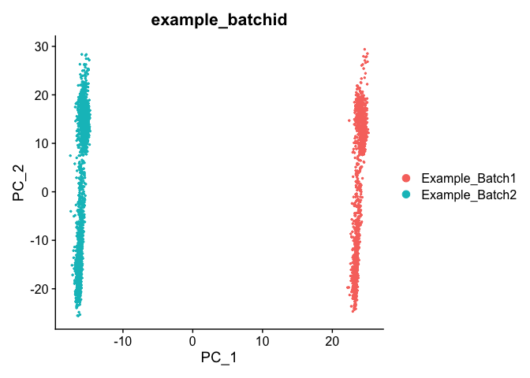
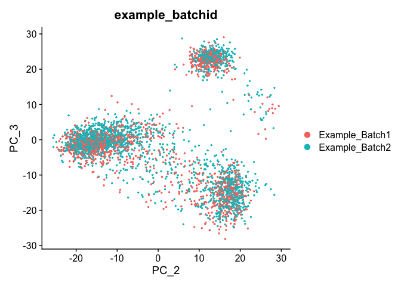
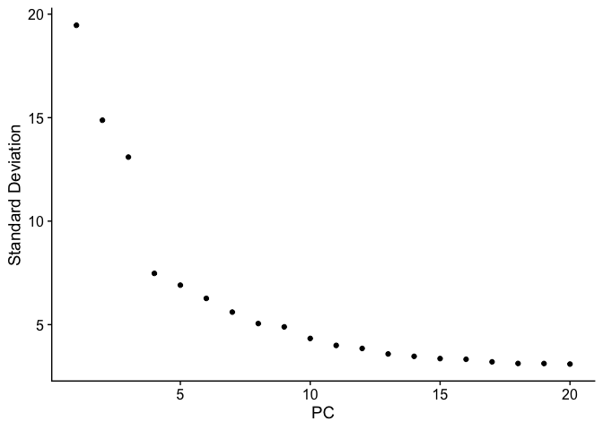
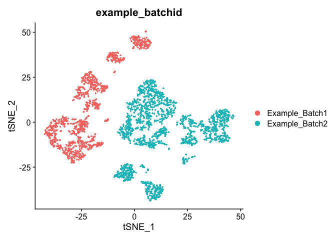
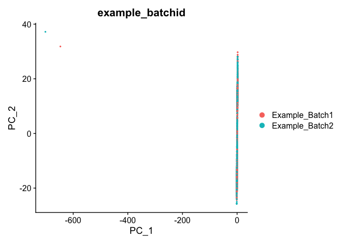
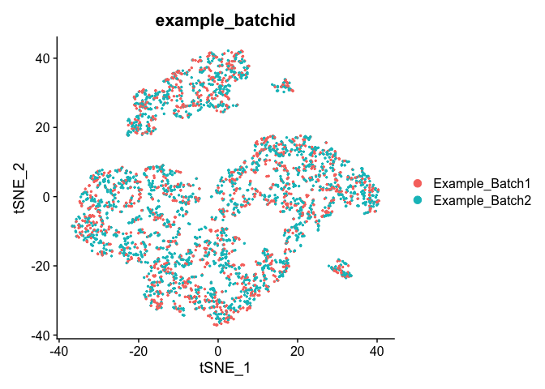

Last Updated: March 24 2021, 11am

# Part 3: Batch Correction Excercise


## Load libraries

```r
library(Seurat)
```

## Load the Seurat object from the prior excercise, and **create a batch effect**


```r
load(file="pre_sample_corrected.RData")
experiment.aggregate
```

<div class='r_output'> An object of class Seurat 
 36601 features across 3343 samples within 1 assay 
 Active assay: RNA (36601 features, 3941 variable features)
</div>
```r
experiment.test <- experiment.aggregate
VariableFeatures(experiment.test) <- rownames(experiment.test)
set.seed(12345)


samplename = experiment.aggregate$orig.ident
rand.cells <- sample(1:ncol(experiment.test), 2000,replace = F)
batchid = rep("Example_Batch1",length(samplename))
batchid[rand.cells] = "Example_Batch2"
names(batchid) = colnames(experiment.aggregate)

experiment.test <- AddMetaData(
  object = experiment.test,
  metadata = batchid,
  col.name = "example_batchid")

table(experiment.test$example_batchid)
```

<div class='r_output'> 
 Example_Batch1 Example_Batch2 
           1343           2000
</div>
```r
mat <- as.matrix(GetAssayData(experiment.test, slot="data"))

rand.genes <- sample(VariableFeatures(experiment.test), 500,replace = F)

mat[rand.genes,experiment.test$example_batchid=="Example_Batch2"] <- mat[rand.genes,experiment.test$example_batchid=="Example_Batch2"] + 0.22
experiment.test = SetAssayData(experiment.test, slot="data", new.data= mat )
rm(mat)
```

## Exploring Batch effects, none, Seurat [vars.to.regress]

First let's view the data without any corrections.

## PCA in prep for tSNE

ScaleData - Scales and centers genes in the data set.

```r
?ScaleData
```


```r
experiment.test.noc <- ScaleData(object = experiment.test)
```

### Run PCA

```r
experiment.test.noc <- RunPCA(object = experiment.test.noc)
DimPlot(object = experiment.test.noc, group.by = "example_batchid", reduction = "pca", shuffle = TRUE)
```



```r
DimPlot(object = experiment.test.noc, group.by = "example_batchid", dims = c(2,3), reduction = "pca", shuffle = TRUE)
```



A PCA Elbow may be used to plot to explore how many principal components to use in downstream analyses. Components after the "elbow" in the plot generally explain little additional variability in the data.


```r
ElbowPlot(experiment.test.noc)
```

<!-- -->

We will use 10 components in downstream analyses. Using more components more closely approximates the full data set but increases run time.

### TSNE Plot

```r
pcs.use <- 10
experiment.test.noc <- RunTSNE(object = experiment.test.noc, dims = 1:pcs.use)
DimPlot(object = experiment.test.noc,  group.by = "example_batchid", shuffle = TRUE)
```



## Correct for sample to sample differences (seurat)

Use vars.to.regress to correct for the sample to sample differences and percent mitochondria

```r
experiment.test.regress <- ScaleData(object = experiment.test,
                    vars.to.regress = c("example_batchid"), model.use = "linear")

experiment.test.regress <- RunPCA(object =experiment.test.regress,features=rownames(experiment.test.noc))

DimPlot(object = experiment.test.regress, group.by = "example_batchid", reduction = "pca", shuffle = TRUE)
```



### Corrected TSNE Plot

```r
experiment.test.regress <- RunTSNE(object = experiment.test.regress, dims.use = 1:50)
DimPlot(object = experiment.test.regress, group.by = "example_batchid", reduction = "tsne")
```



#### Question(s)

1. Try a couple of PCA cutoffs (low and high) and compare the TSNE plots from the different methods.  Do they look meaningfully different?

## Get the next Rmd file

```r
download.file("https://raw.githubusercontent.com/ucdavis-bioinformatics-training/2022-March-Single-Cell-RNA-Seq-Analysis/main/data_analysis/scRNA_Workshop-PART4.Rmd", "scRNA_Workshop-PART4.Rmd")
```

## Session Information

```r
sessionInfo()
```

<div class='r_output'> R version 4.1.2 (2021-11-01)
 Platform: aarch64-apple-darwin20 (64-bit)
 Running under: macOS Monterey 12.0.1
 
 Matrix products: default
 BLAS:   /Library/Frameworks/R.framework/Versions/4.1-arm64/Resources/lib/libRblas.0.dylib
 LAPACK: /Library/Frameworks/R.framework/Versions/4.1-arm64/Resources/lib/libRlapack.dylib
 
 locale:
 [1] en_US.UTF-8/en_US.UTF-8/en_US.UTF-8/C/en_US.UTF-8/en_US.UTF-8
 
 attached base packages:
 [1] stats     graphics  grDevices utils     datasets  methods   base     
 
 other attached packages:
 [1] SeuratObject_4.0.4 Seurat_4.1.0      
 
 loaded via a namespace (and not attached):
   [1] Rtsne_0.15            colorspace_2.0-3      deldir_1.0-6         
   [4] ellipsis_0.3.2        ggridges_0.5.3        rstudioapi_0.13      
   [7] spatstat.data_2.1-2   farver_2.1.0          leiden_0.3.9         
  [10] listenv_0.8.0         ggrepel_0.9.1         fansi_1.0.2          
  [13] codetools_0.2-18      splines_4.1.2         knitr_1.37           
  [16] polyclip_1.10-0       jsonlite_1.8.0        ica_1.0-2            
  [19] cluster_2.1.2         png_0.1-7             uwot_0.1.11          
  [22] shiny_1.7.1           sctransform_0.3.3     spatstat.sparse_2.1-0
  [25] compiler_4.1.2        httr_1.4.2            assertthat_0.2.1     
  [28] Matrix_1.4-0          fastmap_1.1.0         lazyeval_0.2.2       
  [31] cli_3.2.0             later_1.3.0           htmltools_0.5.2      
  [34] tools_4.1.2           igraph_1.2.11         gtable_0.3.0         
  [37] glue_1.6.2            RANN_2.6.1            reshape2_1.4.4       
  [40] dplyr_1.0.8           Rcpp_1.0.8.3          scattermore_0.8      
  [43] jquerylib_0.1.4       vctrs_0.3.8           nlme_3.1-155         
  [46] lmtest_0.9-39         spatstat.random_2.1-0 xfun_0.30            
  [49] stringr_1.4.0         globals_0.14.0        mime_0.12            
  [52] miniUI_0.1.1.1        lifecycle_1.0.1       irlba_2.3.5          
  [55] goftest_1.2-3         future_1.24.0         MASS_7.3-55          
  [58] zoo_1.8-9             scales_1.1.1          spatstat.core_2.4-0  
  [61] promises_1.2.0.1      spatstat.utils_2.3-0  parallel_4.1.2       
  [64] RColorBrewer_1.1-2    yaml_2.3.5            reticulate_1.24      
  [67] pbapply_1.5-0         gridExtra_2.3         ggplot2_3.3.5        
  [70] sass_0.4.0            rpart_4.1.16          stringi_1.7.6        
  [73] highr_0.9             rlang_1.0.2           pkgconfig_2.0.3      
  [76] matrixStats_0.61.0    evaluate_0.15         lattice_0.20-45      
  [79] ROCR_1.0-11           purrr_0.3.4           tensor_1.5           
  [82] labeling_0.4.2        patchwork_1.1.1       htmlwidgets_1.5.4    
  [85] cowplot_1.1.1         tidyselect_1.1.2      parallelly_1.30.0    
  [88] RcppAnnoy_0.0.19      plyr_1.8.6            magrittr_2.0.2       
  [91] R6_2.5.1              generics_0.1.2        DBI_1.1.2            
  [94] mgcv_1.8-39           pillar_1.7.0          fitdistrplus_1.1-8   
  [97] survival_3.3-1        abind_1.4-5           tibble_3.1.6         
 [100] future.apply_1.8.1    crayon_1.5.0          KernSmooth_2.23-20   
 [103] utf8_1.2.2            spatstat.geom_2.3-2   plotly_4.10.0        
 [106] rmarkdown_2.13        grid_4.1.2            data.table_1.14.2    
 [109] digest_0.6.29         xtable_1.8-4          tidyr_1.2.0          
 [112] httpuv_1.6.5          munsell_0.5.0         viridisLite_0.4.0    
 [115] bslib_0.3.1
</div>