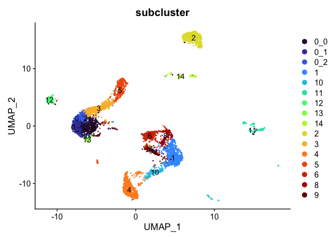

Last Updated: December 8, 2022

# Part 4: Clustering

## Load libraries

```r
library(Seurat)
library(ggplot2)
library(dplyr)
```

## Load the Seurat object

```r
load(file="pca_sample_corrected.RData")
experiment.aggregate
```

```
## An object of class Seurat 
## 21005 features across 10595 samples within 1 assay 
## Active assay: RNA (21005 features, 5986 variable features)
##  1 dimensional reduction calculated: pca
```


## So how many features should we use? Use too few and your leaving out interesting variation that may define cell types, use too many and you add in noise? maybe?

Lets choose the first 25, based on our prior part.


```r
use.pcs = 1:25
```

## Identifying clusters

Seurat implements an graph-based clustering approach. Distances between the cells are calculated based on previously identified PCs. 

The default method for identifying k-nearest neighbors has been changed in V4 to [annoy](https://github.com/spotify/annoy) ("Approximate Nearest Neighbors Oh Yeah!). This is an approximate nearest-neighbor approach that is widely used for high-dimensional analysis in many fields, including single-cell analysis. Extensive community benchmarking has shown that annoy substantially improves the speed and memory requirements of neighbor discovery, with negligible impact to downstream results. 


Seurat prior approach was heavily inspired by recent manuscripts which applied graph-based clustering approaches to scRNAseq data. Briefly, Seurat identified clusters of cells by a shared nearest neighbor (SNN) modularity optimization based clustering algorithm. First calculate k-nearest neighbors (KNN) and construct the SNN graph. Then optimize the modularity function to determine clusters. For a full description of the algorithms, see Waltman and van Eck (2013) The European Physical Journal B. You can switch back to using the previous default setting using nn.method="rann".


The FindClusters function implements the neighbor based clustering procedure, and contains a resolution parameter that sets the granularity of the downstream clustering, with increased values leading to a greater number of clusters. I tend to like to perform a series of resolutions, investigate and choose.


```r
?FindNeighbors
```


```r
experiment.aggregate <- FindNeighbors(experiment.aggregate, reduction="pca", dims = use.pcs)

experiment.aggregate <- FindClusters(
    object = experiment.aggregate,
    resolution = seq(0.25,4,0.5),
    verbose = FALSE
)
```


Seurat add the clustering information to the metadata beginning with RNA_snn_res. followed by the resolution


```r
head(experiment.aggregate[[]])
```

```
##                             orig.ident nCount_RNA nFeature_RNA percent.mito
## AAACCCAAGTTATGGA_A001-C-007 A001-C-007       2076         1547    0.5780347
## AAACCCACAACGCCCA_A001-C-007 A001-C-007        854          687    1.5222482
## AAACCCACAGAAGTTA_A001-C-007 A001-C-007        540          466    1.6666667
## AAACCCACATGATAGA_A001-C-007 A001-C-007        514          438    3.5019455
## AAACCCAGTCAGTCCG_A001-C-007 A001-C-007        605          538    0.9917355
## AAACGAAGTTGGTGTT_A001-C-007 A001-C-007        948          766    0.0000000
##                                  S.Score    G2M.Score Phase  old.ident
## AAACCCAAGTTATGGA_A001-C-007  0.022821930 -0.104890463     S A001-C-007
## AAACCCACAACGCCCA_A001-C-007 -0.008428992  0.123912762   G2M A001-C-007
## AAACCCACAGAAGTTA_A001-C-007  0.016243559 -0.055675102     S A001-C-007
## AAACCCACATGATAGA_A001-C-007  0.095646766  0.173522408   G2M A001-C-007
## AAACCCAGTCAGTCCG_A001-C-007  0.162755666 -0.009395696     S A001-C-007
## AAACGAAGTTGGTGTT_A001-C-007 -0.074341196 -0.047294231    G1 A001-C-007
##                             RNA_snn_res.0.25 RNA_snn_res.0.75 RNA_snn_res.1.25
## AAACCCAAGTTATGGA_A001-C-007                0                1                7
## AAACCCACAACGCCCA_A001-C-007                6               10               15
## AAACCCACAGAAGTTA_A001-C-007                9               13               12
## AAACCCACATGATAGA_A001-C-007                7               11               10
## AAACCCAGTCAGTCCG_A001-C-007                3                3                1
## AAACGAAGTTGGTGTT_A001-C-007               11               16               17
##                             RNA_snn_res.1.75 RNA_snn_res.2.25 RNA_snn_res.2.75
## AAACCCAAGTTATGGA_A001-C-007               10               15               17
## AAACCCACAACGCCCA_A001-C-007               18               17               23
## AAACCCACAGAAGTTA_A001-C-007               13               12               13
## AAACCCACATGATAGA_A001-C-007                9                9                8
## AAACCCAGTCAGTCCG_A001-C-007                1                1                4
## AAACGAAGTTGGTGTT_A001-C-007               21               21               22
##                             RNA_snn_res.3.25 RNA_snn_res.3.75 seurat_clusters
## AAACCCAAGTTATGGA_A001-C-007               17               20              20
## AAACCCACAACGCCCA_A001-C-007               23               24              24
## AAACCCACAGAAGTTA_A001-C-007               12               12              12
## AAACCCACATGATAGA_A001-C-007               19               22              22
## AAACCCAGTCAGTCCG_A001-C-007                4                7               7
## AAACGAAGTTGGTGTT_A001-C-007               22               23              23
```


Lets first investigate how many clusters each resolution produces and set it to the smallest resolutions of 0.5 (fewest clusters).


```r
sapply(grep("res",colnames(experiment.aggregate@meta.data),value = TRUE),
       function(x) length(unique(experiment.aggregate@meta.data[,x])))
```

```
## RNA_snn_res.0.25 RNA_snn_res.0.75 RNA_snn_res.1.25 RNA_snn_res.1.75 
##               17               24               27               33 
## RNA_snn_res.2.25 RNA_snn_res.2.75 RNA_snn_res.3.25 RNA_snn_res.3.75 
##               33               37               40               43
```

### Plot TSNE coloring for each resolution

tSNE dimensionality reduction plots are then used to visualize clustering results. As input to the tSNE, you should use the same PCs as input to the clustering analysis.


```r
experiment.aggregate <- RunTSNE(
  object = experiment.aggregate,
  reduction.use = "pca",
  dims = use.pcs,
  do.fast = TRUE)
```


```r
DimPlot(object = experiment.aggregate, group.by=grep("res",colnames(experiment.aggregate@meta.data),value = TRUE)[1:4], ncol=2 , pt.size=3.0, reduction = "tsne", label = T)
```

<!-- -->


```r
DimPlot(object = experiment.aggregate, group.by=grep("res",colnames(experiment.aggregate@meta.data),value = TRUE)[5:8], ncol=2 , pt.size=3.0, reduction = "tsne", label = T)
```

<!-- -->

1. Try exploring different PCS, so first 5, 10, 15, we used 25, what about 100? How does the clustering change?

Once complete go back to 1:25

### Choosing a resolution

Lets set the default identity to a resolution of 1.25 and produce a table of cluster to sample assignments.

```r
Idents(experiment.aggregate) <- "RNA_snn_res.1.25"
table(Idents(experiment.aggregate),experiment.aggregate$orig.ident)
```

```
##     
##      A001-C-007 A001-C-104 B001-A-301
##   0           0          2       1102
##   1         922          1          0
##   2           3          1        891
##   3          89        787          4
##   4           3          3        684
##   5           1          4        677
##   6          13        660          1
##   7         234        402          4
##   8           1         16        617
##   9           0          1        404
##   10         14        380          7
##   11         56        331          2
##   12         83        164         83
##   13          2          1        269
##   14         45        226          0
##   15        114         75         81
##   16          1          5        203
##   17         96         66         34
##   18          2         57         98
##   19         76         43         27
##   20          6         46         40
##   21          1          2         80
##   22          4         48         28
##   23          2         46          1
##   24          4          9         31
##   25          2         39          0
##   26          0          1         37
```

Plot TSNE coloring by the slot 'ident' (default).

```r
DimPlot(object = experiment.aggregate, pt.size=0.5, reduction = "tsne", label = T)
```

<!-- -->


### UMAP dimensionality reduction plot.


```r
experiment.aggregate <- RunUMAP(
  object = experiment.aggregate,
  dims = use.pcs)
```

Plot UMAP coloring by the slot 'ident' (default).

```r
DimPlot(object = experiment.aggregate, pt.size=0.5, reduction = "umap", label = T)
```

<!-- -->

Catagorical data can be plotted using the DimPlot function.


TSNE plot by cell cycle

```r
DimPlot(object = experiment.aggregate, pt.size=0.5, group.by = "Phase", reduction = "umap")
```

<!-- -->

1. Try creating a table, of cluster x cell cycle

### Can use feature plot to plot our read valued metadata, like nUMI, Feature count, and percent Mito
FeaturePlot can be used to color cells with a 'feature', non categorical data, like number of UMIs

```r
FeaturePlot(experiment.aggregate, features = c('nCount_RNA'), pt.size=0.5)
```

<!-- -->

and number of genes present

```r
FeaturePlot(experiment.aggregate, features = c('nFeature_RNA'), pt.size=0.5)
```

<!-- -->

percent mitochondrial

```r
FeaturePlot(experiment.aggregate, features = c('percent.mito'), pt.size=0.5)
```

<!-- -->

## Building a phylogenetic tree relating the 'average' cell from each group in default 'Ident' (currently "RNA_snn_res.1.25"). Tree is estimated based on a distance matrix constructed in either gene expression space or PCA space.


```r
Idents(experiment.aggregate) <- "RNA_snn_res.1.25"
experiment.aggregate <- BuildClusterTree(
  experiment.aggregate, dims = use.pcs)

PlotClusterTree(experiment.aggregate)
```

<!-- -->


1. Create new trees of other data

Once complete go back to Res 1.25


```r
DimPlot(object = experiment.aggregate, pt.size=0.5, label = TRUE, reduction = "umap")
```

<!-- -->

```r
DimPlot(experiment.aggregate, pt.size = 0.5, label = TRUE, reduction = "tsne")
```

<!-- -->

### Merging clusters

Merge Clustering results, so lets say clusters 0,  and 21 are actually the same cell type and we don't wish to separate them out as distinct clusters. Same with 3, and 25.


```r
experiment.merged = experiment.aggregate
Idents(experiment.merged) <- "RNA_snn_res.1.25"

experiment.merged <- RenameIdents(
  object = experiment.merged,
  '21' = '0',
  '25' = '3'
)

table(Idents(experiment.merged))
```

```
## 
##    0    3    1    2    4    5    6    7    8    9   10   11   12   13   14   15 
## 1187  921  923  895  690  682  674  640  634  405  401  389  330  272  271  270 
##   16   17   18   19   20   22   23   24   26 
##  209  196  157  146   92   80   49   44   38
```

```r
DimPlot(object = experiment.merged, pt.size=0.5, label = T, reduction = "umap")
```

<!-- -->

```r
DimPlot(experiment.merged, pt.size = 0.5, label = TRUE, reduction = "tsne" )
```

<!-- -->

```r
VlnPlot(object = experiment.merged, features = "percent.mito", pt.size = 0.05)
```

<!-- -->

### Reordering the clusters

In order to reorder the clusters for plotting purposes take a look at the levels of the Ident, which indicates the ordering, then relevel as desired.


```r
experiment.examples <- experiment.merged
levels(experiment.examples@active.ident)
```

```
##  [1] "0"  "3"  "1"  "2"  "4"  "5"  "6"  "7"  "8"  "9"  "10" "11" "12" "13" "14"
## [16] "15" "16" "17" "18" "19" "20" "22" "23" "24" "26"
```

```r
experiment.examples@active.ident <- relevel(experiment.examples@active.ident, "12")
levels(experiment.examples@active.ident)
```

```
##  [1] "12" "0"  "3"  "1"  "2"  "4"  "5"  "6"  "7"  "8"  "9"  "10" "11" "13" "14"
## [16] "15" "16" "17" "18" "19" "20" "22" "23" "24" "26"
```

```r
# now cluster 12 is the "first" factor

DimPlot(object = experiment.examples, pt.size=0.5, label = T, reduction = "umap")
```

<!-- -->

```r
VlnPlot(object = experiment.examples, features = "percent.mito", pt.size = 0.05)
```

<!-- -->


```r
# relevel all the factors to the order I want
neworder <- sample(levels(experiment.examples), replace=FALSE)
Idents(experiment.examples) <- factor(experiment.examples@active.ident, levels=neworder)
levels(experiment.examples@active.ident)
```

```
##  [1] "20" "17" "4"  "23" "10" "15" "7"  "1"  "12" "14" "19" "13" "6"  "11" "9" 
## [16] "3"  "24" "8"  "16" "5"  "2"  "18" "0"  "22" "26"
```

```r
DimPlot(object = experiment.examples, pt.size=0.5, label = T, reduction = "umap")
```

<!-- -->

```r
VlnPlot(object = experiment.examples, features = "percent.mito", pt.size = 0.05)
```

<!-- -->


### Re-assign clustering result (subclustering only cluster 0) to clustering for resolution 3.75  (@ reslution 0.25) [adding a R prefix]

```r
newIdent = as.character(Idents(experiment.examples))
newIdent[newIdent == '0'] = paste0("R",as.character(experiment.examples$RNA_snn_res.3.75[newIdent == '0']))

Idents(experiment.examples) <- as.factor(newIdent)
table(Idents(experiment.examples))
```

```
## 
##   1  10  11  12  13  14  15  16  17  18  19   2  20  22  23  24  26   3   4   5 
## 923 401 389 330 272 271 270 209 196 157 146 895  92  80  49  44  38 921 690 682 
##   6   7   8   9  R0 R21 R32 R33  R4 R42  R6  R8 
## 674 640 634 405 668   4 105  91   5   1   2 311
```


```r
DimPlot(object = experiment.examples, pt.size=0.5, label = T, reduction = "umap")
```

<!-- -->

Plot UMAP  coloring by the slot 'orig.ident' (sample names) with alpha colors turned on. A pretty picture

```r
DimPlot(object = experiment.aggregate, group.by="orig.ident", pt.size=0.5, reduction = "umap", shuffle = TRUE)
```

<!-- -->


```r
## Pretty umap using alpha
alpha.use <- 2/5
p <- DimPlot(object = experiment.aggregate, group.by="orig.ident", pt.size=0.5, reduction = "umap", shuffle = TRUE)
p$layers[[1]]$mapping$alpha <- alpha.use
p + scale_alpha_continuous(range = alpha.use, guide = F)
```

<!-- -->

Removing cells assigned to clusters from a plot, So here plot all clusters but cluster 23 (contaminant?)

```r
# create a new tmp object with those removed
experiment.aggregate.tmp <- experiment.aggregate[,-which(Idents(experiment.aggregate) %in% c("23"))]

dim(experiment.aggregate)
```

```
## [1] 21005 10595
```

```r
dim(experiment.aggregate.tmp)
```

```
## [1] 21005 10546
```


```r
DimPlot(object = experiment.aggregate.tmp, pt.size=0.5, reduction = "umap", label = T)
```

<!-- -->

## Identifying Marker Genes

Seurat can help you find markers that define clusters via differential expression.

`FindMarkers` identifies markers for a cluster relative to all other clusters.

`FindAllMarkers` does so for all clusters

`FindAllMarkersNode` defines all markers that split a Node from the cluster tree


```r
?FindMarkers
```


```r
markers = FindMarkers(experiment.aggregate, ident.1=c(4,13), ident.2 = c(6,7))

head(markers)
```

```
##                p_val avg_log2FC pct.1 pct.2     p_val_adj
## KCNMA1  0.000000e+00   4.521474 0.856 0.034  0.000000e+00
## PTPRN2 5.411145e-293   3.441014 0.812 0.063 1.136611e-288
## FCGBP  8.092151e-287   3.416703 0.859 0.133 1.699756e-282
## NEDD4L 1.124816e-279   2.858062 0.941 0.460 2.362675e-275
## MUC2   4.305183e-253   2.915768 0.840 0.141 9.043036e-249
## XIST   5.010454e-243   3.027981 0.682 0.018 1.052446e-238
```

```r
dim(markers)
```

```
## [1] 2270    5
```

```r
table(markers$avg_log2FC > 0)
```

```
## 
## FALSE  TRUE 
##  1229  1041
```

```r
table(markers$p_val_adj < 0.05 & markers$avg_log2FC > 0)
```

```
## 
## FALSE  TRUE 
##  1423   847
```


pct.1 and pct.2 are the proportion of cells with expression above 0 in ident.1 and ident.2 respectively. p_val is the raw p_value associated with the differntial expression test with adjusted value in p_val_adj. avg_logFC is the average log fold change difference between the two groups.


Can use a violin plot to visualize the expression pattern of some markers

```r
VlnPlot(object = experiment.aggregate, features = rownames(markers)[1:2], pt.size = 0.05)
```

<!-- -->

Or a feature plot

```r
FeaturePlot(
    experiment.aggregate,
    features = c("KCNMA1", "LEFTY1"),
    cols = c("lightgrey", "blue"),
    ncol = 2
)
```

<!-- -->

FindAllMarkers can be used to automate the process across all genes.


```r
markers_all <- FindAllMarkers(
    object = experiment.merged,
    only.pos = TRUE,
    min.pct = 0.25,
    thresh.use = 0.25
)
dim(markers_all)
```

```
## [1] 10418     7
```

```r
head(markers_all)
```

```
##          p_val avg_log2FC pct.1 pct.2 p_val_adj cluster     gene
## RBFOX1       0   1.801003 0.891 0.315         0       0   RBFOX1
## NXPE1        0   1.609535 0.970 0.495         0       0    NXPE1
## ADAMTSL1     0   1.599482 0.935 0.410         0       0 ADAMTSL1
## DPP10        0   1.434679 0.643 0.154         0       0    DPP10
## EYA2         0   1.422714 0.496 0.085         0       0     EYA2
## XIST         0   1.396557 0.896 0.281         0       0     XIST
```

```r
table(table(markers_all$gene))
```

```
## 
##    1    2    3    4    5    6    7    8    9   10   11   12 
## 1453  863  680  460  302  170   76   24    8    1    1    1
```

```r
markers_all_single <- markers_all[markers_all$gene %in% names(table(markers_all$gene))[table(markers_all$gene) == 1],]

dim(markers_all_single)
```

```
## [1] 1453    7
```

```r
table(table(markers_all_single$gene))
```

```
## 
##    1 
## 1453
```

```r
table(markers_all_single$cluster)
```

```
## 
##   0   3   1   2   4   5   6   7   8   9  10  11  12  13  14  15  16  17  18  19 
##  27  32 177  15  22   0   4  20 197  82   3  12  23  44  46  28  72  42  41  23 
##  20  22  23  24  26 
##  81  31  87  71 273
```

```r
head(markers_all_single)
```

```
##                 p_val avg_log2FC pct.1 pct.2     p_val_adj cluster    gene
## LEFTY1  1.382475e-158  0.8183984 0.256 0.044 2.903889e-154       0  LEFTY1
## ATP13A4 8.738362e-133  0.6535469 0.264 0.056 1.835493e-128       0 ATP13A4
## MYB     1.904969e-124  0.6899936 0.386 0.117 4.001387e-120       0     MYB
## NDUFAF2  1.026241e-81  0.5774651 0.302 0.101  2.155619e-77       0 NDUFAF2
## AKAP7    1.830143e-68  0.4202497 0.317 0.119  3.844215e-64       0   AKAP7
## LRATD1   7.161102e-56  0.3635457 0.288 0.115  1.504189e-51       0  LRATD1
```

Plot a heatmap of genes by cluster for the top 10 marker genes per cluster

```r
top10 <- markers_all_single %>% group_by(cluster) %>% top_n(10, avg_log2FC)
DoHeatmap(
    object = experiment.merged,
    features = top10$gene
)
```

<!-- -->


```r
# Get expression of genes for cells in and out of each cluster
getGeneClusterMeans <- function(gene, cluster){
  x <- GetAssayData(experiment.merged)[gene,]
  m <- tapply(x, ifelse(Idents(experiment.merged) == cluster, 1, 0), mean)
  mean.in.cluster <- m[2]
  mean.out.of.cluster <- m[1]
  return(list(mean.in.cluster = mean.in.cluster, mean.out.of.cluster = mean.out.of.cluster))
}

## for sake of time only using first six (head)
means <- mapply(getGeneClusterMeans, head(markers_all[,"gene"]), head(markers_all[,"cluster"]))
means <- matrix(unlist(means), ncol = 2, byrow = T)

colnames(means) <- c("mean.in.cluster", "mean.out.of.cluster")
rownames(means) <- head(markers_all[,"gene"])
markers_all2 <- cbind(head(markers_all), means)
head(markers_all2)
```

```
##          p_val avg_log2FC pct.1 pct.2 p_val_adj cluster     gene
## RBFOX1       0   1.801003 0.891 0.315         0       0   RBFOX1
## NXPE1        0   1.609535 0.970 0.495         0       0    NXPE1
## ADAMTSL1     0   1.599482 0.935 0.410         0       0 ADAMTSL1
## DPP10        0   1.434679 0.643 0.154         0       0    DPP10
## EYA2         0   1.422714 0.496 0.085         0       0     EYA2
## XIST         0   1.396557 0.896 0.281         0       0     XIST
##          mean.in.cluster mean.out.of.cluster
## RBFOX1         2.5396188           0.7812035
## NXPE1          3.1683411           1.3435546
## ADAMTSL1       2.8933510           1.0967794
## DPP10          1.3751032           0.3315594
## EYA2           0.9699287           0.1683474
## XIST           2.3334639           0.7333243
```

## Finishing up clusters.

At this point in time you should use the tree, markers, domain knowledge, and goals to finalize your clusters. This may mean adjusting PCA to use, mergers clusters together, choosing a new resolutions, etc. When finished you can further name it cluster by something more informative. Ex.

```r
experiment.clusters <- experiment.aggregate
experiment.clusters <- RenameIdents(
  object = experiment.clusters,
  '0' = 'cell_type_A',
  '1' = 'cell_type_B',
  '2' = 'cell_type_C'
)
# and so on

DimPlot(object = experiment.clusters, pt.size=0.5, label = T, reduction = "tsne")
```

<!-- -->

Right now our results ONLY exist in the Ident data object, lets save it to our metadata table so we don't accidentally loose it.

```r
experiment.merged$finalcluster <- Idents(experiment.merged)
head(experiment.merged[[]])
```

```
##                             orig.ident nCount_RNA nFeature_RNA percent.mito
## AAACCCAAGTTATGGA_A001-C-007 A001-C-007       2076         1547    0.5780347
## AAACCCACAACGCCCA_A001-C-007 A001-C-007        854          687    1.5222482
## AAACCCACAGAAGTTA_A001-C-007 A001-C-007        540          466    1.6666667
## AAACCCACATGATAGA_A001-C-007 A001-C-007        514          438    3.5019455
## AAACCCAGTCAGTCCG_A001-C-007 A001-C-007        605          538    0.9917355
## AAACGAAGTTGGTGTT_A001-C-007 A001-C-007        948          766    0.0000000
##                                  S.Score    G2M.Score Phase  old.ident
## AAACCCAAGTTATGGA_A001-C-007  0.022821930 -0.104890463     S A001-C-007
## AAACCCACAACGCCCA_A001-C-007 -0.008428992  0.123912762   G2M A001-C-007
## AAACCCACAGAAGTTA_A001-C-007  0.016243559 -0.055675102     S A001-C-007
## AAACCCACATGATAGA_A001-C-007  0.095646766  0.173522408   G2M A001-C-007
## AAACCCAGTCAGTCCG_A001-C-007  0.162755666 -0.009395696     S A001-C-007
## AAACGAAGTTGGTGTT_A001-C-007 -0.074341196 -0.047294231    G1 A001-C-007
##                             RNA_snn_res.0.25 RNA_snn_res.0.75 RNA_snn_res.1.25
## AAACCCAAGTTATGGA_A001-C-007                0                1                7
## AAACCCACAACGCCCA_A001-C-007                6               10               15
## AAACCCACAGAAGTTA_A001-C-007                9               13               12
## AAACCCACATGATAGA_A001-C-007                7               11               10
## AAACCCAGTCAGTCCG_A001-C-007                3                3                1
## AAACGAAGTTGGTGTT_A001-C-007               11               16               17
##                             RNA_snn_res.1.75 RNA_snn_res.2.25 RNA_snn_res.2.75
## AAACCCAAGTTATGGA_A001-C-007               10               15               17
## AAACCCACAACGCCCA_A001-C-007               18               17               23
## AAACCCACAGAAGTTA_A001-C-007               13               12               13
## AAACCCACATGATAGA_A001-C-007                9                9                8
## AAACCCAGTCAGTCCG_A001-C-007                1                1                4
## AAACGAAGTTGGTGTT_A001-C-007               21               21               22
##                             RNA_snn_res.3.25 RNA_snn_res.3.75 seurat_clusters
## AAACCCAAGTTATGGA_A001-C-007               17               20              20
## AAACCCACAACGCCCA_A001-C-007               23               24              24
## AAACCCACAGAAGTTA_A001-C-007               12               12              12
## AAACCCACATGATAGA_A001-C-007               19               22              22
## AAACCCAGTCAGTCCG_A001-C-007                4                7               7
## AAACGAAGTTGGTGTT_A001-C-007               22               23              23
##                             finalcluster
## AAACCCAAGTTATGGA_A001-C-007            7
## AAACCCACAACGCCCA_A001-C-007           15
## AAACCCACAGAAGTTA_A001-C-007           12
## AAACCCACATGATAGA_A001-C-007           10
## AAACCCAGTCAGTCCG_A001-C-007            1
## AAACGAAGTTGGTGTT_A001-C-007           17
```

```r
table(experiment.merged$finalcluster, experiment.merged$orig.ident)
```

```
##     
##      A001-C-007 A001-C-104 B001-A-301
##   0           1          4       1182
##   3          91        826          4
##   1         922          1          0
##   2           3          1        891
##   4           3          3        684
##   5           1          4        677
##   6          13        660          1
##   7         234        402          4
##   8           1         16        617
##   9           0          1        404
##   10         14        380          7
##   11         56        331          2
##   12         83        164         83
##   13          2          1        269
##   14         45        226          0
##   15        114         75         81
##   16          1          5        203
##   17         96         66         34
##   18          2         57         98
##   19         76         43         27
##   20          6         46         40
##   22          4         48         28
##   23          2         46          1
##   24          4          9         31
##   26          0          1         37
```

## Subsetting samples and plotting

If you want to look at the representation of just one sample, or sets of samples

```r
experiment.sample1 <- subset(experiment.merged, orig.ident == "A001-C-007")

DimPlot(object = experiment.sample1, group.by = "RNA_snn_res.0.25", pt.size=0.5, label = TRUE, reduction = "tsne")
```

<!-- -->

### Adding in a new metadata column representing samples within clusters. So differential expression of A001-C-007 vs B001-A-301 within cluster 0


```r
experiment.merged$samplecluster = paste(experiment.merged$orig.ident,experiment.merged$finalcluster,sep = '_')

# set the identity to the new variable
Idents(experiment.merged) <- "samplecluster"

markers.comp <- FindMarkers(experiment.merged, ident.1 = c("A001-C-007_12", "A001-C-104_12"), ident.2= "B001-A-301_12")

head(markers.comp)
```

```
##                p_val avg_log2FC pct.1 pct.2    p_val_adj
## SLC26A2 1.103276e-42  -3.406530 0.138 0.904 2.317432e-38
## XIST    2.145342e-34  -3.351456 0.000 0.530 4.506291e-30
## GUCA2A  4.025474e-31  -3.190970 0.020 0.554 8.455508e-27
## PDE3A   8.506056e-27  -2.909730 0.032 0.530 1.786697e-22
## PHGR1   2.436331e-26  -2.546360 0.113 0.699 5.117514e-22
## SLC26A3 4.059153e-26  -2.597649 0.089 0.663 8.526252e-22
```

```r
experiment.subset <- subset(experiment.merged, samplecluster %in%  c( "A001-C-007_12", "A001-C-104_12", "B001-A-301_12" ))
DoHeatmap(object = experiment.subset, features = head(rownames(markers.comp),20))
```

<!-- -->


```r
Idents(experiment.merged) <- "finalcluster"
```

And last lets save all the Seurat objects in our session.

```r
save(list=grep('experiment', ls(), value = TRUE), file="clusters_seurat_object.RData")
```

## Get the next Rmd file

```r
download.file("https://raw.githubusercontent.com/ucdavis-bioinformatics-training/2022-December-Single-Cell-RNA-Seq-Analysis/main/data_analysis/scRNA_Workshop-PART5.Rmd", "scRNA_Workshop-PART5.Rmd")
```

## Session Information

```r
sessionInfo()
```

```
## R version 4.2.2 (2022-10-31)
## Platform: x86_64-apple-darwin17.0 (64-bit)
## Running under: macOS Catalina 10.15.7
## 
## Matrix products: default
## BLAS:   /Library/Frameworks/R.framework/Versions/4.2/Resources/lib/libRblas.0.dylib
## LAPACK: /Library/Frameworks/R.framework/Versions/4.2/Resources/lib/libRlapack.dylib
## 
## locale:
## [1] en_US.UTF-8/en_US.UTF-8/en_US.UTF-8/C/en_US.UTF-8/en_US.UTF-8
## 
## attached base packages:
## [1] stats     graphics  grDevices utils     datasets  methods   base     
## 
## other attached packages:
## [1] dplyr_1.0.10       ggplot2_3.4.0      SeuratObject_4.1.3 Seurat_4.3.0      
## 
## loaded via a namespace (and not attached):
##   [1] ggbeeswarm_0.6.0       Rtsne_0.16             colorspace_2.0-3      
##   [4] deldir_1.0-6           ellipsis_0.3.2         ggridges_0.5.4        
##   [7] rstudioapi_0.14        spatstat.data_3.0-0    farver_2.1.1          
##  [10] leiden_0.4.3           listenv_0.8.0          ggrepel_0.9.2         
##  [13] fansi_1.0.3            codetools_0.2-18       splines_4.2.2         
##  [16] cachem_1.0.6           knitr_1.41             polyclip_1.10-4       
##  [19] jsonlite_1.8.3         ica_1.0-3              cluster_2.1.4         
##  [22] png_0.1-8              uwot_0.1.14            shiny_1.7.3           
##  [25] sctransform_0.3.5      spatstat.sparse_3.0-0  compiler_4.2.2        
##  [28] httr_1.4.4             assertthat_0.2.1       Matrix_1.5-3          
##  [31] fastmap_1.1.0          lazyeval_0.2.2         limma_3.54.0          
##  [34] cli_3.4.1              later_1.3.0            htmltools_0.5.3       
##  [37] tools_4.2.2            igraph_1.3.5           gtable_0.3.1          
##  [40] glue_1.6.2             RANN_2.6.1             reshape2_1.4.4        
##  [43] Rcpp_1.0.9             scattermore_0.8        jquerylib_0.1.4       
##  [46] vctrs_0.5.1            ape_5.6-2              nlme_3.1-160          
##  [49] spatstat.explore_3.0-5 progressr_0.11.0       lmtest_0.9-40         
##  [52] spatstat.random_3.0-1  xfun_0.35              stringr_1.4.1         
##  [55] globals_0.16.2         mime_0.12              miniUI_0.1.1.1        
##  [58] lifecycle_1.0.3        irlba_2.3.5.1          goftest_1.2-3         
##  [61] future_1.29.0          MASS_7.3-58.1          zoo_1.8-11            
##  [64] scales_1.2.1           promises_1.2.0.1       spatstat.utils_3.0-1  
##  [67] parallel_4.2.2         RColorBrewer_1.1-3     yaml_2.3.6            
##  [70] reticulate_1.26        pbapply_1.6-0          gridExtra_2.3         
##  [73] ggrastr_1.0.1          sass_0.4.4             stringi_1.7.8         
##  [76] highr_0.9              rlang_1.0.6            pkgconfig_2.0.3       
##  [79] matrixStats_0.63.0     evaluate_0.18          lattice_0.20-45       
##  [82] tensor_1.5             ROCR_1.0-11            purrr_0.3.5           
##  [85] labeling_0.4.2         patchwork_1.1.2        htmlwidgets_1.5.4     
##  [88] cowplot_1.1.1          tidyselect_1.2.0       parallelly_1.32.1     
##  [91] RcppAnnoy_0.0.20       plyr_1.8.8             magrittr_2.0.3        
##  [94] R6_2.5.1               generics_0.1.3         DBI_1.1.3             
##  [97] withr_2.5.0            pillar_1.8.1           fitdistrplus_1.1-8    
## [100] survival_3.4-0         abind_1.4-5            sp_1.5-1              
## [103] tibble_3.1.8           future.apply_1.10.0    crayon_1.5.2          
## [106] KernSmooth_2.23-20     utf8_1.2.2             spatstat.geom_3.0-3   
## [109] plotly_4.10.1          rmarkdown_2.18         grid_4.2.2            
## [112] data.table_1.14.6      digest_0.6.30          xtable_1.8-4          
## [115] tidyr_1.2.1            httpuv_1.6.6           munsell_0.5.0         
## [118] beeswarm_0.4.0         viridisLite_0.4.1      vipor_0.4.5           
## [121] bslib_0.4.1
```
